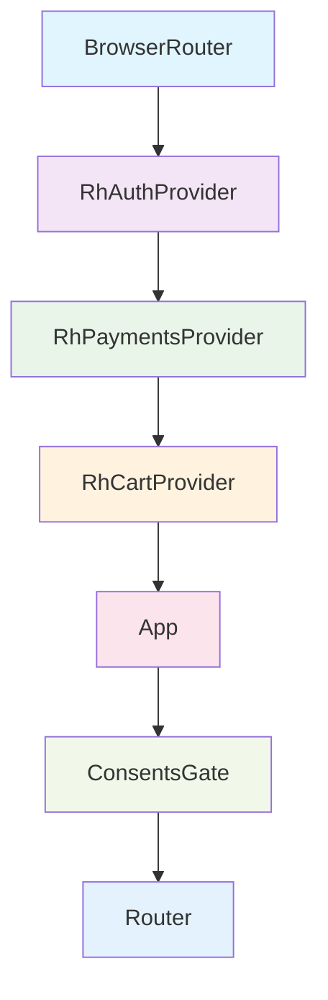

# Architecture Overview

This application is a client-side React Single-Page Application (SPA) that communicates with a Ulabase service via `@ulabase/kit-react`. There is no custom backend; all server-side logic is handled by the Ulabase service.

## Bootstrap Process

The application bootstraps through a carefully orchestrated sequence:

1. **Entry Point**: `index.html` loads `src/main.tsx` as a module
2. **Provider Nesting**: The app wraps itself in a provider hierarchy that establishes context for auth, payments, and cart functionality
3. **Fragment Token Capture**: `App.tsx` captures any `access_token` from the URL fragment for OAuth flows
4. **API Validation**: If `apiUrl` is not configured or invalid, the app shows a `ConfigPage` fallback
5. **Consents Gate**: For authenticated users, the `ConsentsGate` component wraps the router to enforce Terms/Privacy acceptance

## Provider Tree

The application uses a nested provider structure that establishes all necessary contexts:

**Provider Responsibilities**:
- **BrowserRouter**: React Router context for navigation
- **RhAuthProvider**: Authentication state, session management, user data
- **RhPaymentsProvider**: Stripe payments integration and billing portal
- **RhCartProvider**: Shopping cart state and persistence
- **App**: Core application logic including fragment token capture and API validation
- **ConsentsGate**: Enforces Terms of Service and Privacy Policy acceptance for authenticated users

## Route Map and Guards

The application uses React Router with lazy-loaded routes and feature-flag gating. The shop is intentionally outside `AuthGuard` to allow guest browsing and purchasing.

### Core Routes

| Path | Guard | Shown When | Purpose |
|------|-------|------------|---------|
| `/` | None (Shell) | Always | Shop front page |
| `/product/:id` | None (Shell) | Always | Individual product page |
| `/cart` | None (Shell) | Always | Shopping cart |
| `/orders` | None (Shell) | Always | Order history and Stripe return |
| `/terms` | None (Shell) | Always | Terms of Service (readable while consents gate is up) |
| `/privacy` | None (Shell) | Always | Privacy Policy (readable while consents gate is up) |
| `/checkout` | None (Shell) | Always | Redirects to `/cart` (kept for bookmarked URLs) |
| `/order` | None (Shell) | Always | Redirects to `/orders` (kept for success URL compatibility) |

### Auth Routes (Feature-flagged)

| Path | Guard | Feature Flag | Purpose |
|------|-------|--------------|---------|
| `/auth/login` | PublicGuard | Always | Login form |
| `/auth/signup` | PublicGuard | `emailRegistration` or `oauthLogin` | Registration form |
| `/auth/verify` | PublicGuard | `emailRegistration` | Email verification |
| `/auth/forgot-password` | PublicGuard | `passwordReset` | Password reset request |
| `/auth/reset-password` | PublicGuard | `passwordReset` | Password reset form |

### Invitation Routes

| Path | Guard | Feature Flag | Purpose |
|------|-------|--------------|---------|
| `/invitations/accept` | None | `teamInvitations` | Team invitation acceptance (works signed-in or out) |

### Protected Routes (require authentication)

| Path | Guard | Purpose |
|------|-------|---------|
| `/profile` | AuthGuard | User profile management |
| `/billing` | AuthGuard | Billing accounts list |
| `/billing/new` | AuthGuard | New billing account creation |
| `/billing/:id` | AuthGuard | Billing account details |

### Catch-all Route

| Path | Destination | Purpose |
|------|-------------|---------|
| `*` | `/` | Redirects unknown paths to the shop |

## Shell Component

The `Shell` component (`src/pages/shell/Shell.tsx`) wraps all routes except auth pages. It provides:

- **Header and Navigation**: Logo, Shop/Cart links, theme switcher
- **User Menu**: Avatar with dropdown for authenticated users
- **Guest Actions**: Login/Sign up buttons for unauthenticated users
- **Theme Toggle**: Light/dark mode persisted in localStorage
- **Scroll Management**: Resets scroll position on page navigation
- **Outlet Rendering**: Renders child routes via React Router's `<Outlet />`

The Shell intentionally has no `AuthGuard` around it, ensuring guests see the header and navigation on all shop pages.

## Consents Gate

The `ConsentsGate` (`src/ConsentsGate.tsx`) enforces Terms/Privacy acceptance for authenticated users:

- **Position**: Sits above the router in the component tree
- **Mechanism**: Listens for `451` responses from the Ulabase service via `consents-signal.ts`
- **Trigger**: Session restoration (`/users/me`) fails with `451` if user hasn't accepted current Terms
- **User Experience**: Shows acceptance overlay with checkboxes for Terms and Privacy
- **Legal Pages**: `/terms` and `/privacy` remain accessible while the gate is active
- **Server Enforcement**: The overlay is UX only; the server continues returning `451` until acceptance

## Lazy Loading and Suspense

All routes use React's lazy loading with a custom `SuspenseWrapper`:

- **Lazy Imports**: Each route component is dynamically imported
- **Suspense Fallback**: Shows a minimal "Loading..." message instead of a spinner
- **Performance**: Reduces initial bundle size and improves load times
- **UX Consideration**: Deliberately quiet fallback to avoid distraction during Stripe redirects

## Feature Flags

Feature flags in `src/environments/environment.ts` control which routes and UI elements are available:

- **`emailRegistration`**: Enables signup and email verification routes
- **`passwordReset`**: Enables forgot/reset password routes
- **`oauthLogin`**: Enables OAuth login (Google sign-in)
- **`teamInvitations`**: Enables team invitation acceptance route

When a feature flag is disabled, both the route and any UI linking to it are removed.

## Configuration Fallback

If `apiUrl` is not configured or invalid:

1. `App.tsx` validates the URL using `isValidApiBaseUrl`
2. If invalid, renders `ConfigPage` instead of the router
3. `ConfigPage` shows setup instructions and the current `apiUrl` value
4. No API calls are made; the app is in a safe, non-functional state

## Key Design Decisions

1. **No Custom Backend**: All server logic lives in the Ulabase service; the frontend is a pure SPA
2. **Guest-First Shop**: The shop is at `/` and outside `AuthGuard` to maximize conversion
3. **Consents Above Router**: The consents gate sits above the router because a blocked user can't pass `AuthGuard`
4. **Shell for Everyone**: The Shell provides consistent navigation for both guests and authenticated users
5. **Fragment Token Capture**: OAuth tokens are captured from URL fragments and stripped from history
6. **Feature-Flag Gating**: Routes and UI are removed when features are disabled, not just hidden
