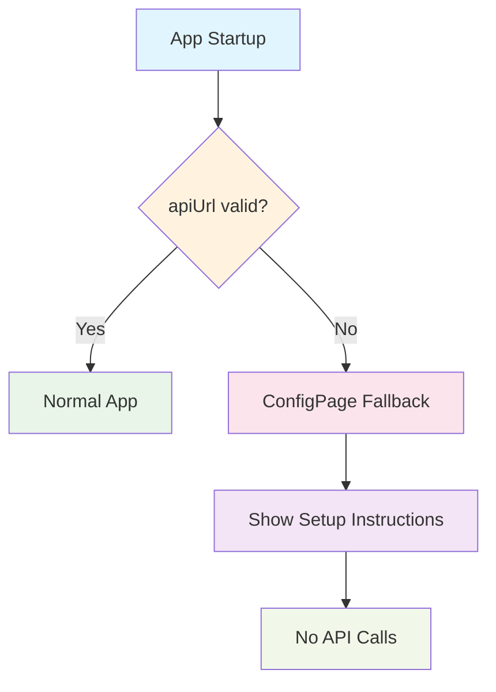

# Feature Flags and Environment Configuration

The Ulabase Starter Ecommerce app uses a centralized environment configuration file (`src/environments/environment.ts`) to control which features are available at runtime. This configuration determines the API endpoint, collection names, and which authentication and team management features are enabled.

## Environment Configuration

The `environment` object contains four main sections:

### 1. API Endpoint (`apiUrl`)

The `apiUrl` property points to your Ulabase tenant service:

```typescript
// Must be your service URL: https://<id>.ulabase.app
// NOT https://api.ulabase.com (the admin node)
apiUrl: '',
```

**Important**: The URL must:
- Start with `https://`
- Point to your tenant service (`https://<id>.ulabase.app`)
- NOT point to `https://api.ulabase.com` (Ulabase's admin control plane)

**Validation**: The app validates `apiUrl` at startup using `isValidApiBaseUrl()` from `@ulabase/kit-react`. If the URL is empty or not HTTPS:
1. `App.tsx` renders a `ConfigPage` instead of the router
2. `ConfigPage` shows setup instructions and the current `apiUrl` value
3. No API calls are made; the app is in a safe, non-functional state
4. An error is logged to the console



*When apiUrl is invalid or empty, the app shows a configuration page instead of the normal application.*

### 2. Collection Names

```typescript
catalogCollection: 'catalog',
catalogOrdersCollection: 'orders',
```

These names must match the collection names configured on your Ulabase service. The service uses defaults (`catalog` and `orders`) if not explicitly configured.

### 3. Feature Flags

The `features` object controls which authentication and team management features are available:

```typescript
features: {
  emailRegistration: true,
  passwordReset: true,
  oauthLogin: false, // Google sign-in: off until you create its OAuth client
  oauthProviders: ['google'] as const,
  teamInvitations: true,
}
```

## Feature Flag Details

### `emailRegistration`
- **Purpose**: Enables email/password registration and email verification
- **Default**: `true`
- **Routes affected**: `/auth/signup`, `/auth/verify`
- **UI affected**: Signup links in login page, verification flows
- **Server requirement**: Must match service's "Sign-up Mgmt → Features → Email Registration" toggle

### `passwordReset`
- **Purpose**: Enables password reset functionality
- **Default**: `true`
- **Routes affected**: `/auth/forgot-password`, `/auth/reset-password`
- **UI affected**: "Forgot password" link on login page
- **Server requirement**: Must match service's "Sign-up Mgmt → Features → Password Reset" toggle

### `oauthLogin`
- **Purpose**: Enables OAuth login (currently only Google)
- **Default**: `false`
- **Routes affected**: `/auth/signup` (when combined with `emailRegistration`)
- **UI affected**: Google sign-in button on login/signup pages
- **Server requirement**: Must match service's "Sign-up Mgmt → Features → OAuth" toggle
- **Additional setup**: Requires Google OAuth client credentials

### `oauthProviders`
- **Purpose**: List of OAuth providers to support
- **Default**: `['google']`
- **Current limitation**: Only Google is implemented in the starter

### `teamInvitations`
- **Purpose**: Enables team invitation acceptance
- **Default**: `true`
- **Routes affected**: `/invitations/accept`
- **UI affected**: Invitation acceptance flows
- **Server requirement**: Must match service's "Sign-up Mgmt → Features → Invitations" toggle

## How Feature Flags Gate Routes

The `routes.tsx` file uses destructured feature flags to conditionally include/exclude routes:

```typescript
const { emailRegistration, passwordReset, oauthLogin, teamInvitations } = environment.features;
```

Routes are included using JavaScript's spread operator with ternary expressions:

```typescript
// Include signup route if email registration OR OAuth login is enabled
...(emailRegistration || oauthLogin
  ? [
      {
        path: 'auth/signup',
        element: (
          <SuspenseWrapper>
            <PublicGuard>
              <Signup />
            </PublicGuard>
          </SuspenseWrapper>
        ),
      },
    ]
  : []),

// Include verification route if email registration is enabled
...(emailRegistration
  ? [
      {
        path: 'auth/verify',
        element: (
          <SuspenseWrapper>
            <PublicGuard>
              <Verify />
            </PublicGuard>
          </SuspenseWrapper>
        ),
      },
    ]
  : []),

// Include password reset routes if password reset is enabled
...(passwordReset
  ? [
      {
        path: 'auth/forgot-password',
        element: (
          <SuspenseWrapper>
            <PublicGuard>
              <ForgotPassword />
            </PublicGuard>
          </SuspenseWrapper>
        ),
      },
      {
        path: 'auth/reset-password',
        element: (
          <SuspenseWrapper>
            <PublicGuard>
              <ResetPassword />
            </PublicGuard>
          </SuspenseWrapper>
        ),
      },
    ]
  : []),

// Include invitation route if team invitations are enabled
...(teamInvitations
  ? [
      {
        path: 'invitations/accept',
        element: (
          <SuspenseWrapper>
            <Accept />
          </SuspenseWrapper>
        ),
      },
    ]
  : []),
```

## Server-Client Synchronization

**Critical**: Feature flags in `environment.ts` must match the service's "Sign-up Mgmt → Features" toggles. A mismatch causes silent failures:

1. **Client flag ON, server feature OFF**: Routes exist but API calls fail
2. **Client flag OFF, server feature ON**: Features work but aren't accessible

The `ulabase.setup.ts` file automatically synchronizes these flags when you run `ulabase setup`:

```typescript
const f = environment.features;

const features = {
  registration: f.emailRegistration,
  verification: f.emailRegistration, // emailRegistration covers both registration and verification
  'password-reset': f.passwordReset,
  invitations: f.teamInvitations,
  oauth: f.oauthLogin,
};
```

## Default Configuration

The starter comes with these defaults:
- **`emailRegistration`**: `true` (email/password signup enabled)
- **`passwordReset`**: `true` (password reset enabled)
- **`oauthLogin`**: `false` (Google sign-in disabled until you set up OAuth)
- **`oauthProviders`**: `['google']` (only Google supported)
- **`teamInvitations`**: `true` (team invitations enabled)

## Enabling Google Sign-in

To enable Google OAuth login:

1. **Create OAuth client** in Google Cloud console:
   - Type: Web application
   - Redirect URI: `https://<srvId>.ulabase.app/auth/oauth/callback/google`

2. **Update environment.ts**:
   ```typescript
   oauthLogin: true, // Change from false to true
   ```

3. **Run setup with credentials**:
   ```bash
   GOOGLE_CLIENT_ID=… GOOGLE_CLIENT_SECRET=… ulabase setup --srv <srvId>
   ```

The credentials go to the service, never into the app.

## Disabling Features

To disable a feature:

1. **Update environment.ts**:
   ```typescript
   emailRegistration: false, // Disable email registration
   passwordReset: false,     // Disable password reset
   teamInvitations: false,   // Disable team invitations
   ```

2. **Run setup again**:
   ```bash
   ulabase setup --srv <srvId>
   ```

When a feature flag is disabled:
- The route is completely removed from the router
- Any UI that links to the disabled feature is removed
- The server-side feature is also disabled via the setup command

## Important Notes

1. **apiUrl Validation**: Empty or non-HTTPS `apiUrl` shows `ConfigPage` instead of the app
2. **Tenant Service URL**: Must use `https://<id>.ulabase.app`, NOT `https://api.ulabase.com`
3. **Feature Synchronization**: Flags must match service's "Sign-up Mgmt Features" toggles
4. **Silent Failures**: Mismatched flags cause silent failures - routes exist but don't work
5. **Setup Command**: Always run `ulabase setup --srv <srvId>` after changing feature flags

## Related Documentation

- [Architecture Overview](../architecture/overview.md) - Overall system architecture
- [Service Setup](./service-setup.md) - How to configure your Ulabase service
- [Consents Gate](../workflows/consents-gate.md) - How Terms/Privacy acceptance works
