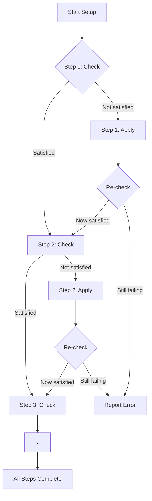
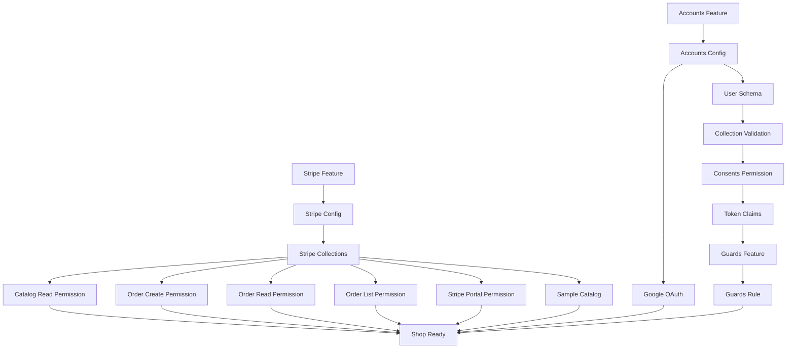

# Service Setup (ulabase.setup.ts)

The `ulabase.setup.ts` file is a declarative setup configuration that defines what a Ulabase service needs to run the shop application. It specifies check and apply steps for every service configuration, ensuring the service is properly configured with all required features, permissions, and data.

## Overview

The setup file replaces manual configuration checklists with executable code. Instead of remembering which settings must match or running multiple scripts, a single command configures the entire service:

```bash
npx @ulabase/cli setup --srv <srvId>
```

With `--dry-run`, it checks what the service is missing without making changes. Every step is idempotent—running against an already-configured service writes nothing and reports each step as satisfied.

## The Check/Apply Pattern

Each configuration step follows a two-phase pattern:

1. **Check**: Examines whether the desired state is already satisfied
2. **Apply**: Configures the service if the check fails

This pattern ensures:
- **Idempotency**: Re-running against a configured service writes nothing
- **Safety**: Checks verify actual state, not just presence of configuration
- **Transparency**: `--dry-run` shows exactly what needs fixing
- **Reliability**: Failed applies can be retried without side effects



*The setup process: each step checks state, applies if needed, then re-checks to verify success.*

## Step Groups

### Stripe Configuration

The setup installs and configures Stripe for payment processing:

1. **Feature Installation**: Installs the Stripe feature plugin
2. **Products Mode Configuration**: Configures Stripe products, success/cancel URLs, shipping countries, session expiration, and notification settings
3. **Collections Initialization**: Creates required collections (`orders`, `transactions`) with proper indexes

### ACL Permissions

Four permissions control catalog and order access:

- **Catalog Read**: Allows anyone (`$unauthenticated` and `user` roles) to browse purchasable products
- **Order Creation**: Allows anyone to place orders via POST
- **Order Read**: Allows reading individual orders with secret verification
- **Order List**: Allows signed-in users to list orders from their billing account
- **Stripe Portal**: Allows signed-in users to access Stripe billing portal

### Accounts Configuration

The accounts feature provides authentication:

1. **Feature Installation**: Installs the accounts feature
2. **Configuration**: Sets app name, frontend URLs, and feature flags (registration, verification, password reset, invitations, OAuth)
3. **Google OAuth** (optional): Configures Google OAuth credentials when enabled

### User Schema and Validation

A JSON schema validates user documents:

- **Schema Storage**: Stores a schema that defines required fields (`_id`, `password`, `roles`, `profile`)
- **Collection Validation**: Applies the schema to the `users` collection
- **Consents Fields**: Includes `latestConsents` and `consents` fields for legal document tracking

### Consents System

The consents system manages legal document acceptance:

1. **Permission**: Allows users to update their own consents via PATCH
2. **Token Claims**: Ensures `latestConsents/tos`, `latestConsents/pp`, and `team` are included in authentication tokens
3. **Guards Rule**: Blocks users who haven't accepted current legal versions

## Secrets Handling

Secrets are managed with a "variable wins" strategy:

```typescript
const secret = (name: string, stored: unknown) => {
  const fromEnvironment = process.env[name];
  if (fromEnvironment !== undefined && fromEnvironment !== '') {
    pushed.add(name);
    return fromEnv(name);
  }
  if (configured(stored)) return stored;
  return fromEnv(name);
};
```

**Key principles:**
- `fromEnv` marks a secret for resolution at apply time
- Environment variables override stored values ("variable wins")
- Stored secrets read back as bullets; empty strings mean never set
- Re-running against a configured service needs no secrets in the environment
- Changing a secret from the environment works by exporting the key and re-running

## SHOPPERS Role Configuration

The shop sells to both guests and signed-in users:

```typescript
const SHOPPERS = ['$unauthenticated', 'user'];
```

**Why one permission with two roles, not two permissions:**

The ACL authorizer matches only the first permission it finds for a request. With two separate permissions:
- `$unauthenticated` alone would break for signed-in users (they'd get 403)
- Two rules for the same path would make which one applies depend on role order

One permission with both roles ensures consistent access regardless of authentication state.

## Catalog Seeding

The setup includes demo products for initial shop display:

- **Content, not configuration**: Seeds only when catalog is empty
- **Never overwrites**: Re-running the setup doesn't reset real data to demo data
- **Idempotent**: Uses upsert to allow partial seeding runs
- **Delete when ready**: Remove the seeding step when the shop becomes yours

## Versioned Legal Documents

Legal document versions are managed centrally:

- **TOS_VERSION** and **PP_VERSION** define current versions
- **Permission stamps** versions when users accept
- **Guards rule** compares token claims against current versions
- **Updating versions** forces re-acceptance on next request

## Dependencies and Order

The steps have logical dependencies:



*Step dependencies: Stripe and accounts configurations are independent, but consents require accounts to be configured first.*

## Running the Setup

### Basic Usage
```bash
npx @ulabase/cli setup --srv <srvId>
```

### Dry Run (Check Only)
```bash
npx @ulabase/cli setup --srv <srvId> --dry-run
```

### Environment Variables
- `SHOP_ORIGIN`: Where the shop is served from (default: `http://localhost:5173`)
- `APP_NAME`: Shown in emails (default: `Ulabase Shop`)
- `STRIPE_SECRET_KEY`: Stripe secret key
- `STRIPE_WEBHOOK_SECRET`: Stripe webhook secret
- `GOOGLE_CLIENT_ID`: Google OAuth client ID
- `GOOGLE_CLIENT_SECRET`: Google OAuth client secret

## Invariants and Failures

**Key invariants:**
- Every step must be idempotent
- Checks verify actual state, not just presence
- Secrets are resolved at apply time, not check time
- Catalog data is never overwritten by setup runs

**Failure modes:**
- Missing environment variables cause `fromEnv` to throw
- Invalid configurations are caught by service validation
- Version mismatches between permission and guards rule cause permanent blocking
- Missing ACL permissions result in 403 errors for specific operations

## Extension Points

The setup can be extended by:
- Adding new steps to the `defineSetup` array
- Modifying the `SHOPPERS` roles for different access patterns
- Updating `SHIPPING_COUNTRIES` for different regions
- Adding new legal document versions
- Customizing the user schema for additional fields

## Configuration/Operations

**Updating legal documents:**
1. Edit `TOS_VERSION` and `PP_VERSION` in `src/legal-versions.ts`
2. Re-run the setup
3. All users will be prompted to accept new versions on next request

**Changing secrets:**
1. Export the environment variable (e.g., `STRIPE_SECRET_KEY`)
2. Re-run the setup
3. The new value will be written to the service

**Adding products:**
1. Edit `src/catalog.seed.json`
2. Re-run setup (only affects empty catalogs)
3. Or manually add products to the catalog collection

## Related Pages

- [Ulabase and Kit](../concepts/ulabase-and-kit.md) - Overview of the Ulabase platform
- [Stripe Integration](../integrations/stripe.md) - Stripe-specific configuration details
- [Ulabase Service](../integrations/ulabase-service.md) - Service architecture and APIs
- [Purchase Flow](../workflows/purchase-flow.md) - How purchases work end-to-end
