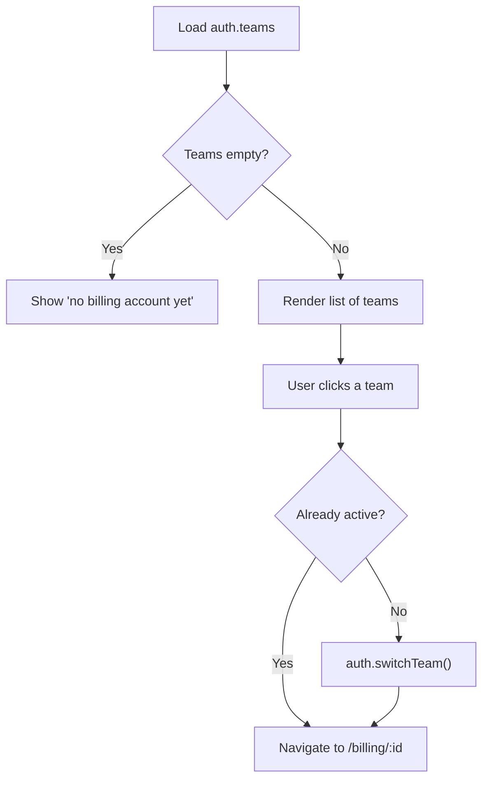
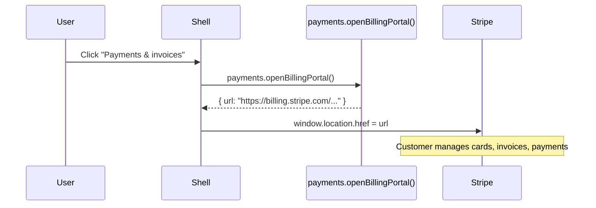
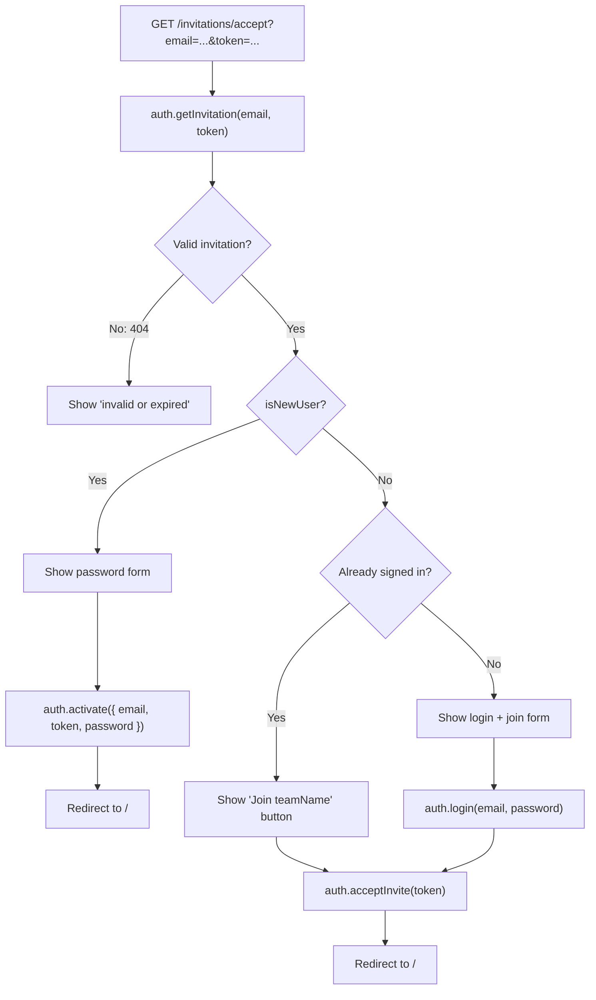

# Billing Accounts (Teams)

The billing accounts feature allows authenticated users to create and manage named accounts that purchases are charged to. Multiple people can share a billing account — they see the same orders and the same Stripe payment history. Under the hood the kit calls this a **team**; the shop UI renames it to "billing account" because customers do not think of themselves as joining a team.

## Naming: Team vs. Billing Account

The Ulabase kit (`@ulabase/kit` and `@ulabase/kit-react`) uses the term **team** throughout its API: `auth.teams`, `auth.createTeam()`, `auth.switchTeam()`, and so on. The server, ACL permissions, and JWT claims all follow the same vocabulary.

The shop UI calls the same entity a **billing account**. This rename happens only in the customer-facing strings and labels — the component code, route parameters, and kit calls still use "team". A comment in `Billing.tsx` explains the reasoning:

> The server calls this a team, and the kit's API says `teams` all the way down. In a shop nobody has a team — they have an account things are charged to, and sometimes more than one: their own, and the company's. Renaming it only here, where a customer reads it, keeps the kit's vocabulary intact and the customer's plain.

## Pages

| Route | Component | Purpose |
|---|---|---|
| `/billing` | `Billing.tsx` | Lists all billing accounts; highlights the active one; supports switching |
| `/billing/new` | `NewBillingAccount.tsx` | Creates a new billing account |
| `/billing/:id` | `BillingAccount.tsx` | Account detail: settings, members, invitations, Stripe portal |

All three routes sit behind `AuthGuard` (defined in `routes.tsx`).

## Billing.tsx — Account List

`Billing.tsx` loads the user's teams via `auth.loadTeams()` and renders a list. Each row shows:

- **Account name** (falls back to the team's ObjectId)
- **Description** (optional)
- **Member role** (owner / member)
- **Active badge** for the currently active team

Switching teams updates `team.active`, which determines which billing account new orders are charged to. The list page then navigates to the detail page.

## NewBillingAccount.tsx — Create Account

A simple form that calls `auth.createTeam(teamName)` and redirects to `/billing` on success. The team name is the only required field.

## BillingAccount.tsx — Account Detail

The detail page loads once on mount, fetching three data sets:

1. **Teams** via `auth.loadTeams()` — to find the matching `TeamMembership` by route param
2. **Members** via `auth.listTeamMembers()` — list of `TeamMember` objects
3. **Invitations** via `auth.listInvitations()` — list of `PendingInvitation` objects

### Team Settings

Owners can update the account name and description via `auth.updateTeam()`. A dirty-tracking flag disables the save button until something changes.

### Members

The member list shows each member's name, email, and role. If the current user is the **owner**:

- A `<select>` lets them change a member's role (`member` ↔ `owner`) via `auth.updateMemberRole()`.
- A **Remove** button (with confirmation) calls `auth.removeMember()`.
- The owner cannot change their own role or remove themselves from the list UI.

Non-owners see the role as read-only text.

### Invitations

Owners can invite new members by email, selecting a role (`member` or `owner`). The form calls `auth.invite(email, role)`.

A 409 error means the person is already a member of this billing account; the UI shows "This person can already charge to this billing account."

Pending invitations are listed with:

- Email, role, creation date, and expiry status
- A **Resend** button that calls `auth.resendInvite()` with a **5-minute cooldown** enforced client-side via `resendCooldownsRef`

### Delete Account

Only the owner sees a "Delete this billing account" section. Deletion calls `auth.deleteTeam()`, then reloads teams. If other teams remain and none is active, it switches to the first one. The button shows a confirmation dialog before proceeding.

The delete is only possible while no other members remain — the server enforces this constraint.

## Stripe Billing Portal

Signed-in users can access the Stripe customer portal from the user menu in the shell header ("Payments & invoices"). This portal, hosted by Stripe, shows payment methods, past payments, and invoices.

**Error handling:**

- **402** — No Stripe Customer exists yet because the user has never made a purchase. The UI shows "Nothing to show yet — this opens once you have bought something."
- **403** — The service ACL does not allow opening the billing portal. The UI suggests re-running `ulabase setup`.
- Other errors surface the message from the API.

Guest checkouts have no Stripe Customer, so the portal is not available to them.

## Team.active and Order Charging

The active team determines which billing account new orders are charged to. When a user switches teams via `auth.switchTeam()`, the JWT claims update to reflect the new active team. The orders collection ACL uses a `readFilter` on `payer.id` matching `@user.team._id`, which means:

- All members of a billing account share visibility of the same orders.
- Orders are filtered to show only those charged to the user's active billing account.
- Guest checkouts (no account) are not filtered by team.

This filtering is configured server-side in `ulabase.setup.ts` and enforced by the ACL, not by the client.

## Invitation Acceptance Flow

The `/invitations/accept` route (feature-flagged by `teamInvitations`) handles three scenarios:

The link carries `email` and `token` as query parameters. Missing parameters show an "Invalid invitation link" page.

## Data Model

The kit represents these entities (types from `@ulabase/kit-react`):

| Type | Key Fields | Purpose |
|---|---|---|
| `TeamMembership` | `id`, `name`, `description`, `role`, `active` | A team the current user belongs to |
| `TeamMember` | `email`, `name`, `role` | A member of the current team |
| `PendingInvitation` | `email`, `role`, `createdAt`, `expired` | An outstanding invitation |

The `team` claim in the JWT connects the user's session to their active team, which the ACL reads for order filtering.

## Configuration

Billing accounts require:

1. **`teamInvitations: true`** in `environment.ts` features — enables the invitation acceptance route and the invite UI.
2. **ACL permissions** configured by `ulabase setup`:
   - Order list permission with `readFilter: { 'payer.id': '@user.team._id' }` — filters orders by billing account.
   - Stripe portal permission — allows signed-in users to access `payments.openBillingPortal()`.
3. **JWT claims** including `team` — configured in `ulabase.setup.ts` via `CLAIMS = ['latestConsents/tos', 'latestConsents/pp', 'team']`.
