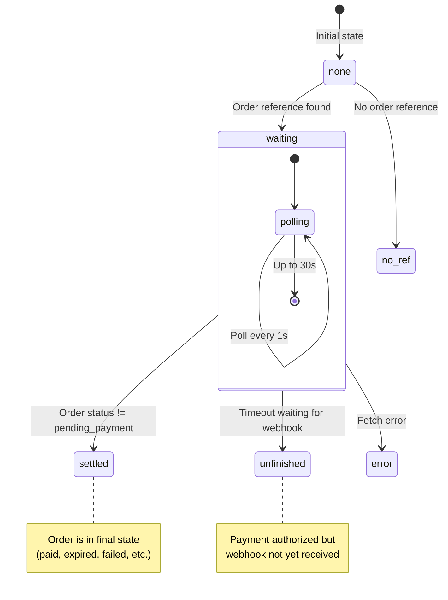
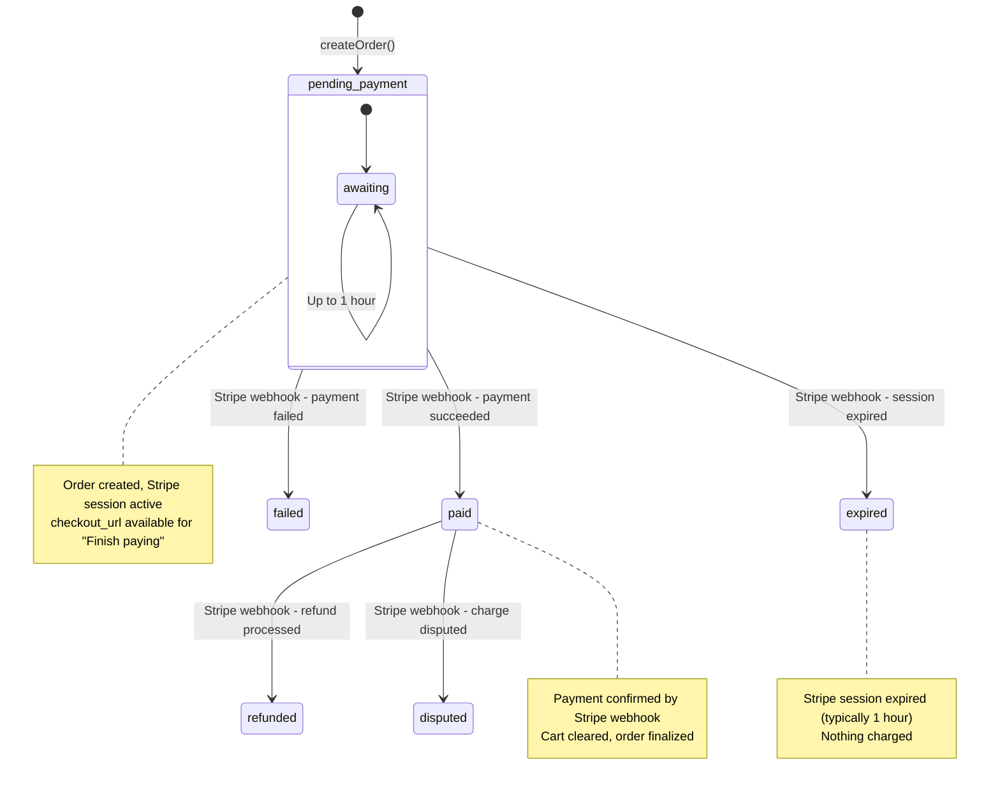

# Cart and Order Lifecycle

This page documents the complete lifecycle of shopping carts and orders in the Ulabase e-commerce starter, from adding items through payment confirmation and order history. The system manages a client-side cart that transitions to server-side orders during checkout, with careful handling of the Stripe redirect gap.

## Cart State Management

The cart is **entirely client-side** until checkout, managed by `RhCartProvider` from `@ulabase/kit-react`. There is no server storage of cart contents before an order is created.

### Provider Setup

The cart provider wraps the entire application in `src/main.tsx`:

```tsx
<RhAuthProvider config={config}>
  <RhPaymentsProvider config={config}>
    <RhCartProvider>
      <App />
    </RhCartProvider>
  </RhPaymentsProvider>
</RhAuthProvider>
```

The provider must sit inside `RhAuthProvider` because it reads the user context from it.

### Cart Data Structure

Cart lines preserve variant information through the `options` property. When a product has variants (e.g., size, color), the cart line stores which variant was chosen:

```tsx
interface CartLine {
  productId: string;          // e.g., "product-id/variant-id" or just "product-id"
  name: string;
  image?: string;
  unitAmount: number;
  currency: string;
  quantity: number;
  options?: Record<string, string>;  // e.g., { color: "yellow", size: "L" }
}
```

### Cart Operations

The `useCart()` hook provides:

- **`cart.lines`** - Array of cart line items
- **`cart.add(productId, quantity, options?)`** - Add item to cart
- **`cart.setQuantity(productId, quantity)`** - Update quantity
- **`cart.remove(productId)`** - Remove item from cart
- **`cart.clear()`** - Empty the entire cart
- **`cart.subtotal`** - Sum of line totals (for display only)
- **`cart.currency`** - Cart currency
- **`cart.totalItems`** - Total number of items
- **`cart.orderItems`** - Items formatted for order creation (preserves variant options)

### Important Invariant

**Cart is NOT cleared at checkout start.** The cart remains intact until payment is confirmed on the Orders page. This is critical because:

1. Users who reach Stripe and change their mind can return to find their cart intact
2. Stripe's cancel link brings users back to the cart page
3. Clearing at checkout would lose the cart for abandoned payments

## Checkout Process

### Step 1: Build Order Items

The cart's `orderItems` property is used directly, not hand-rolled objects:

```tsx
const items = cart.orderItems;
```

This preserves variant options (e.g., which color/size was chosen). Creating `{ productId, quantity }` objects manually would lose this information.

### Step 2: Create Order

```tsx
const order = await payments.createOrder(
  items,
  undefined,  // No email - Stripe collects this
  environment.catalogOrdersCollection
);
```

The server prices the order from its own catalog - the cart amounts are for display only.

### Step 3: Stash Pending Order

Before redirecting to Stripe, save the order reference locally:

```tsx
rememberPendingOrder(order._id.$oid, order.secret);
```

### Step 4: Redirect to Stripe

```tsx
window.location.href = order.checkout_url;
```

The success URL is configured server-side and cannot carry the order ID or secret. The service URL template is:

```
/orders#order={ORDER_ID}&secret={ORDER_SECRET}
```

The secret is placed in the URL fragment (after `#`) so it never reaches server logs or Referer headers.

## Pending-Order Stash

The pending-order system (`src/shop/pending-order.ts`) solves the problem of identifying orders when buyers return from Stripe, especially for guest users with no session.

### Why localStorage (Not sessionStorage)

- Buyers may complete payment in a different tab
- sessionStorage doesn't follow across tabs
- localStorage persists across tabs and sessions

### Data Structure

```typescript
interface PendingOrder {
  id: string;           // Order ID
  secret: string;       // Order secret (treat as password)
  createdAt: number;    // Epoch ms - used for expiry
}
```

### Constraints

- **Maximum entries:** 10 (oldest removed when exceeded)
- **Maximum age:** 24 hours (entries older than this are automatically dropped)
- **List, not single entry:** Supports multiple concurrent checkouts (e.g., two tabs open on the same shop)

### Operations

- **`rememberPendingOrder(id, secret)`** - Add/update entry (newest first)
- **`readPendingOrder()`** - Get most recent pending order
- **`readPendingOrders()`** - Get all pending orders
- **`clearPendingOrder(id?)`** - Clear one order (by ID) or all orders

### Security

The order secret is treated like a password. Entries are dropped as soon as the order reaches a final state (paid, expired, etc.).

## Orders Page

The Orders page (`src/pages/shop/Orders.tsx`) serves dual roles:

1. **Stripe return page** - Polls for payment confirmation
2. **Order history** - Lists orders for signed-in users

### Stripe Return Flow

When a user returns from Stripe, the page reads the order reference from two sources (in priority order):

1. **URL fragment** - Interpolated by the service into the success URL
2. **localStorage stash** - Fallback from `readPendingOrder()`

The URL fragment is read once and immediately stripped from the address bar to prevent the secret from being screenshotted, shared, or bookmarked.

### Confirming State Machine

The page tracks payment confirmation through a state machine:



**States:**

- **`none`** - No order reference found (page opened normally, not returned from Stripe)
- **`waiting`** - Polling for order status (waiting for webhook)
- **`settled`** - Order reached final state (paid, expired, failed, etc.)
- **`unfinished`** - Payment authorized but webhook not received within timeout
- **`error`** - Error reading order

### Polling Mechanism

For users just returning from Stripe:

```tsx
payments.waitForOrder(ref.id, ref.secret, {
  collection: environment.catalogOrdersCollection,
  timeoutMs: 30_000,    // 30 second timeout
  intervalMs: 1_000,    // Poll every second
  signal: controller.signal,
});
```

**Why poll?** Stripe redirects as soon as payment is authorized, but the order only moves off `pending_payment` when Stripe's webhook arrives - a separate connection, usually seconds later, with no ordering guarantee against the redirect.

For users just viewing history (not returning from payment):
- Single read via `payments.getOrder()`
- No polling needed

### Cart Clearing Logic

The cart is cleared **only on confirmed payment**:

```tsx
if (result.status === 'paid') cart.clear();
```

This ensures:
- Abandoned checkouts preserve the cart
- Failed payments preserve the cart
- Expired orders preserve the cart
- Only successful purchases clear the cart

### Pending Order Cleanup

When an order reaches a final state, it's removed from the pending orders list:

```tsx
if (result.status !== 'pending_payment') clearPendingOrder(ref.id);
```

This prevents stale entries from accumulating and avoids confusing "unfinished" states for orders that are actually completed.

## Order Lifecycle

Orders move through the following states:



### State Descriptions

**`pending_payment`**
- Initial state after order creation
- Stripe checkout session is active
- User can complete payment via `checkout_url`
- Stripe expires session automatically (typically 1 hour)
- "Awaiting payment" in the UI

**`paid`**
- Payment confirmed by Stripe webhook
- Order finalized, cart cleared
- Receipt email sent (if configured)
- Shipping address recorded from Stripe

**`expired`**
- Stripe session expired before payment
- Nothing charged
- "Not paid in time" in the UI

**`failed`**
- Payment attempt failed
- Nothing charged
- "Payment failed" in the UI

**`refunded`**
- Payment was refunded (partial or full)
- Refund email sent (if configured)

**`disputed`**
- Charge was disputed (chargeback)
- Requires resolution

### UI Handling

The Orders page displays status with human-readable explanations:

```tsx
case 'pending_payment': {
  const deadline = when(order.expires_at);
  return {
    label: 'Awaiting payment',
    note: deadline
      ? `Not paid yet. If you left Stripe without paying, this cancels itself by ${deadline}.`
      : 'Not paid yet. If you left Stripe without paying, this cancels itself shortly.',
  };
}
```

**`pending_payment` orders include a "Finish paying" button** that links to the original Stripe checkout session.

## Order History

For signed-in users, the Orders page lists all orders:

```tsx
auth.api(`/${environment.catalogOrdersCollection}?sort=-_id&pagesize=25`)
```

The ACL's `readFilter` ensures users only see their own orders. The query returns orders newest-first, limited to 25 per page.

### Guest vs. Authenticated

- **Guest users:** No order history (orders tied to billing account)
- **Authenticated users:** See all orders charged to their billing account
- **Both:** Can see the order just completed (if returning from Stripe)

## Error Handling

### Checkout Errors

- **401:** Service requires account to order (ACL decision)
- **Other:** Generic checkout failure message

### Order Reading Errors

- **404 on URL return:** Order not found (contact support)
- **404 on stash fallback:** Stale entry, silently cleared
- **Timeout:** Payment authorized but webhook late, shows "unfinished" state

### Pending Order Errors

- **localStorage full:** Silent failure, falls back to asking for order ID
- **Parse errors:** Returns empty list, treated as no pending orders

## Security Considerations

1. **Order secret treated as password** - Never exposed in URLs, logs, or error messages
2. **URL fragment for secret** - Doesn't reach server logs or Referer headers
3. **Immediate URL cleanup** - Secret stripped from address bar on page load
4. **Pending order expiry** - 24-hour automatic cleanup
5. **Final state cleanup** - Orders removed from stash when completed

## Integration Points

### Stripe

- Creates checkout sessions via `payments.createOrder()`
- Receives payment confirmation via webhooks
- Handles refunds and disputes
- Collects shipping address and email

### Ulabase Service

- Stores orders in configured collection (default: `orders`)
- Applies pricing from catalog
- Manages ACL and read filters
- Interpolates order ID/secret into success URL

### Cart Provider

- Client-side state management
- Persists across page navigation
- Clears on confirmed payment
- Provides `orderItems` with variant options

## Testing Considerations

Key scenarios to test:

1. **Normal flow:** Add to cart → checkout → pay → return → cart cleared
2. **Abandoned checkout:** Add to cart → checkout → abandon → return → cart preserved
3. **Multiple tabs:** Two tabs checking out simultaneously
4. **Guest checkout:** No account, order identified by secret
5. **Webhook delay:** Payment authorized but webhook arrives late
6. **Expired session:** Leave Stripe open >1 hour
7. **Failed payment:** Card declined
8. **Return without payment:** Use Stripe's cancel link

## Configuration

### Success URL Template

Configured in `ulabase.setup.ts`:

```tsx
const SUCCESS_URL = `${origin}/orders#order={ORDER_ID}&secret={ORDER_SECRET}`;
```

Variables:
- `{ORDER_ID}` - Order ID (interpolated by service)
- `{ORDER_SECRET}` - Order secret (interpolated by service)
- `{CHECKOUT_SESSION_ID}` - Stripe session ID (available but not used)

### Cancel URL

```tsx
const CANCEL_URL = `${origin}/cart`;
```

Returns users to cart with items preserved.

### Collection Names

```typescript
catalogCollection: 'catalog',
catalogOrdersCollection: 'orders',
```

Configured in `src/environments/environment.ts` and must match service configuration.
