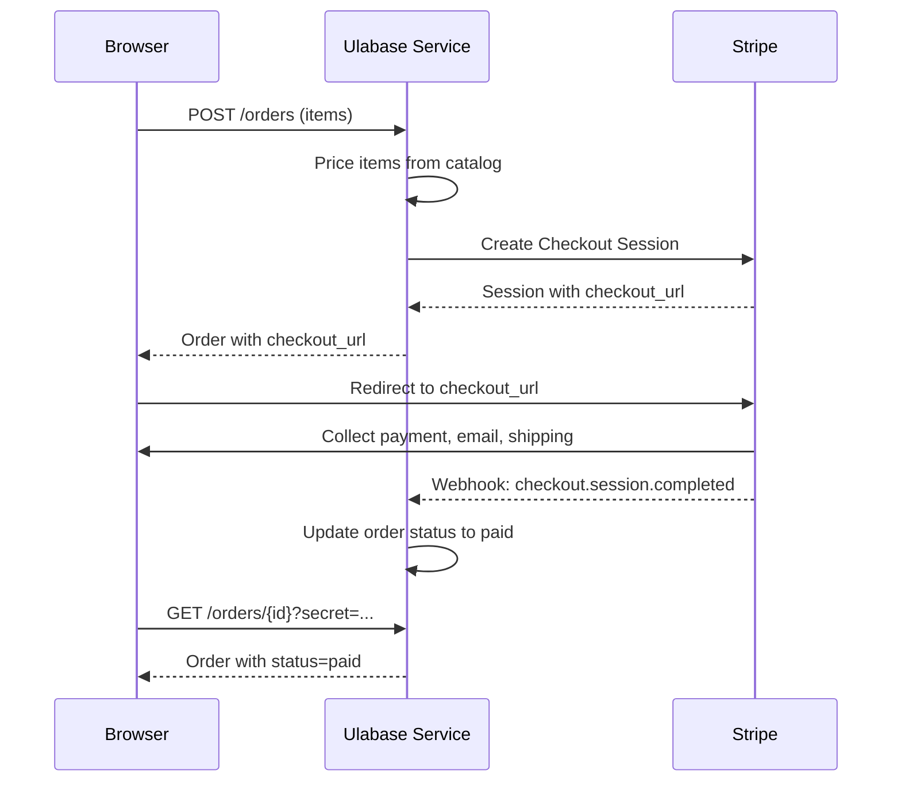
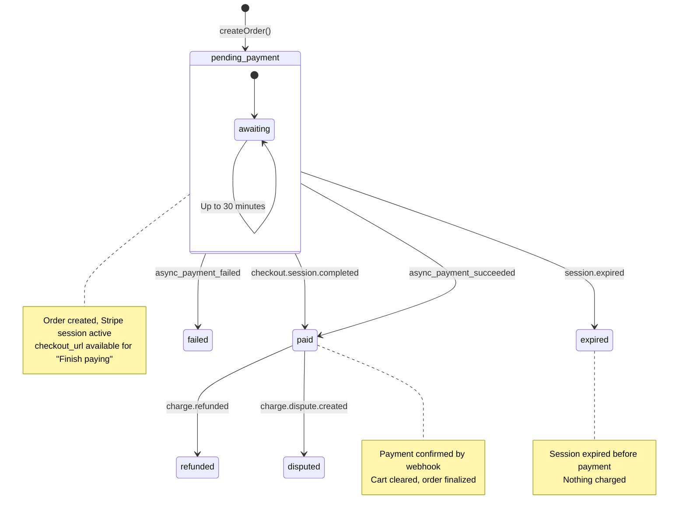
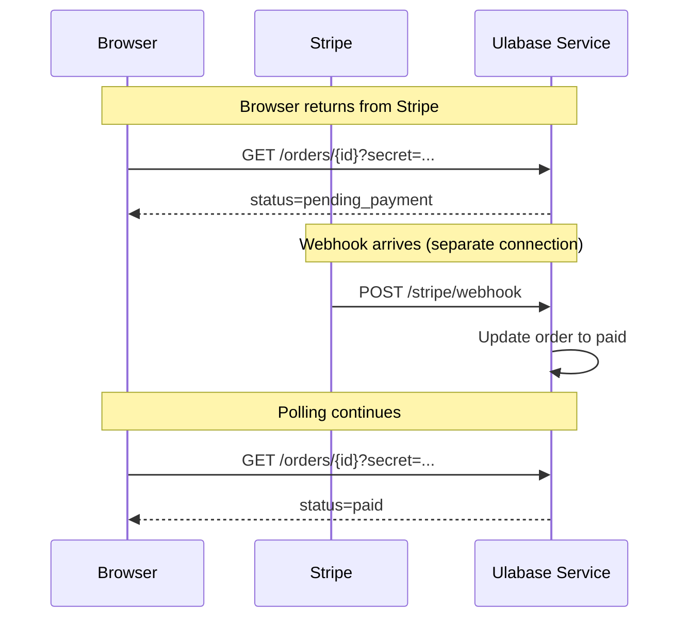

# Stripe Payment Integration

This page documents the Stripe payment integration in the Ulabase e-commerce starter, covering configuration, checkout flow, webhook handling, order lifecycle, and operational considerations.

## Overview

The shop uses Stripe's **products mode** integration via the Ulabase `stripe` feature plugin. This provides:

- Server-side order creation and pricing from the catalog
- Stripe Checkout sessions for payment processing
- Webhook-driven order status updates
- Shipping address collection by Stripe
- Email collection by Stripe (no app-side collection needed)
- Tax calculation delegated to Stripe's Checkout configuration



*The payment flow: order creation, Stripe Checkout, webhook notification, and order confirmation.*

## Products Mode Configuration

The `stripe` feature plugin operates in **products mode**, configured via `ulabase.setup.ts`:

### Required Collections

- **`catalog`** — Stores product documents with pricing and availability
- **`orders`** — Stores order documents with status, items, and payment references
- **`transactions`** — Stores Stripe transaction records (created by `initFeature`)

### Key Configuration Fields

```typescript
{
  products: {
    enabled: true,
    'catalog-collection': 'catalog',
    'orders-collection': 'orders',
    'default-currency': 'eur',
    'success-url': 'https://your-app.example.com/orders#order={ORDER_ID}&secret={ORDER_SECRET}',
    'cancel-url': 'https://your-app.example.com/cart',
    'session-expires-minutes': 30,
    'shipping-address-countries': ['IT', 'FR', 'DE', 'ES', 'AT', 'BE', 'NL', 'PT'],
    notifications: {
      'order-confirmed': { enabled: true },
      'order-refunded': { enabled: true }
    }
  },
  'secret-key': 'sk_test_...',
  'webhook-secret': 'whsec_...'
}
```

### Success URL Configuration

The success URL must include `{ORDER_ID}` and `{ORDER_SECRET}` in the **fragment** (after `#`). Stripe only substitutes `{CHECKOUT_SESSION_ID}`, but the Ulabase service interpolates the order ID and secret:

```
https://your-app.example.com/orders#order={ORDER_ID}&secret={ORDER_SECRET}
```

**Why the fragment?** The secret is a credential. Placing it in the fragment prevents it from reaching:
- Server logs
- `Referer` headers
- Browser history (address bar)
- Screenshots or bookmarks

The Orders page reads the fragment with `readOrderRef()` and immediately strips it with `clearOrderRef()`.

### Session Expiration

Checkout sessions expire after **30 minutes** (configurable via `session-expires-minutes`). An order sits in `pending_payment` from creation until:
- Payment succeeds (webhook: `checkout.session.completed`)
- Session expires (webhook: `checkout.session.expired`)
- Payment fails (webhook: `checkout.session.async_payment_failed`)

The 30-minute default balances abandonment visibility against session lifetime.

### Shipping Countries

An explicit list of ISO 3166-1 alpha-2 codes. An empty list means Checkout never shows the address form, which is how orders ended up with `shipping_address: null` while charging for delivery.

## Checkout Session Creation

The client creates orders via `payments.createOrder()`:

```typescript
const order = await payments.createOrder(
  cart.orderItems,  // Preserves variant options
  undefined,        // No email - Stripe collects this
  environment.catalogOrdersCollection
);
```

**Key points:**
- **No email collection** — Stripe collects email on its own page; the webhook writes `buyer_email` back
- **No shipping address** — Stripe collects this; webhook writes `shipping_address` onto the order
- **Server-side pricing** — The service prices items from its own catalog; cart amounts are display-only
- **Variant preservation** — `cart.orderItems` includes variant options; hand-rolled `{ productId, quantity }` would lose them

The response includes:
- `order._id.$oid` — Order ID
- `order.secret` — Secret for guest order access
- `order.checkout_url` — Stripe Checkout URL

### Pending Order Stash

Before redirecting, the client stashes the order reference in `localStorage`:

```typescript
rememberPendingOrder(order._id.$oid, order.secret);
```

This solves the problem of identifying orders when buyers return from Stripe, especially for guests with no session. The stash:
- Uses `localStorage` (not `sessionStorage`) to persist across tabs
- Stores a list (not single entry) to support multiple concurrent checkouts
- Expires entries older than 24 hours
- Limits to 10 entries (oldest removed when exceeded)

## Webhook Events

Six webhook events drive order status transitions:

### 1. `checkout.session.completed`

**Trigger:** Payment succeeded (or payment not required)
**Action:** Marks order as `paid`
**Data:** Includes customer details, shipping address, payment intent

### 2. `checkout.session.async_payment_succeeded`

**Trigger:** Delayed payment method succeeded (e.g., bank transfer)
**Action:** Marks order as `paid`
**Use case:** SEPA, iDEAL, or other async payment methods

### 3. `checkout.session.async_payment_failed`

**Trigger:** Delayed payment method failed
**Action:** Marks order as `failed`
**Use case:** Bank transfer declined or expired

### 4. `checkout.session.expired`

**Trigger:** Session expired before payment (default 30 minutes)
**Action:** Marks order as `expired`
**Effect:** Nothing charged; order terminal state

### 5. `charge.refunded`

**Trigger:** Full or partial refund processed
**Action:** Updates order with refund amount; may mark as `refunded`
**Use case:** Manual refunds from Stripe dashboard

### 6. `charge.dispute.created`

**Trigger:** Charge disputed (chargeback)
**Action:** Marks order as `disputed`
**Effect:** Requires resolution; funds held

## Order Status Transitions



*Order lifecycle: from creation through payment or expiration, with post-payment states.*

### State Descriptions

**`pending_payment`**
- Initial state after order creation
- Stripe checkout session is active
- User can complete payment via `checkout_url`
- "Awaiting payment" in the UI
- "Finish paying" button links to original Stripe session

**`paid`**
- Payment confirmed by Stripe webhook
- Order finalized, cart cleared
- Receipt email sent (if notifications enabled)
- Shipping address recorded from Stripe

**`expired`**
- Stripe session expired before payment
- Nothing charged
- "Not paid in time" in the UI

**`failed`**
- Payment attempt failed
- Nothing charged
- "Payment failed" in the UI

**`refunded`**
- Payment was refunded (partial or full)
- Refund email sent (if notifications enabled)

**`disputed`**
- Charge was disputed (chargeback)
- Requires resolution

## Webhook-to-Order Flow

The webhook arrives on a **separate connection** from the redirect, which is why the Orders page polls:



*The polling gap: Stripe redirects immediately, but the webhook arrives seconds later on a separate connection.*

### Polling Mechanism

```typescript
payments.waitForOrder(ref.id, ref.secret, {
  collection: environment.catalogOrdersCollection,
  timeoutMs: 30_000,    // 30 second timeout
  intervalMs: 1_000,    // Poll every second
  signal: controller.signal,
});
```

**Why poll?** Stripe redirects as soon as payment is authorized, but the order only moves off `pending_payment` when the webhook arrives. A single read would routinely tell someone who just paid that they had not.

### Timeout Handling

If the webhook doesn't arrive within 30 seconds:
- Payment is authorized (Stripe has the money)
- Order stays `pending_payment`
- UI shows "unfinished" state
- Secret preserved so reload picks up where left off
- Order will update when webhook eventually arrives

## Stock Handling

Stock management is **optimistic** and **atomic**:

### Stock Fields

- **`in_stock`** on product/variant — Optional; absent means "not counted"
- **`purchasable`** — Shop decision; `false` means not for sale
- **`in_stock: 0`** — Shelf decision; "Sold out"

### Atomic Decrement

When payment lands (`checkout.session.completed`), the server decrements `in_stock` atomically per line item. This prevents double-selling but allows overselling:

```typescript
// Two people buy the last item
// Both payments succeed
// Second order pushes count below zero
// Second order marked oversold: true
```

### Oversold Orders

An order that pushed `in_stock` below zero is marked `oversold: true`. The shop refunds it from the Stripe dashboard, which comes back as `charge.refunded` and is already handled.

**Why not reserve?** Reserving requires:
- An endpoint for reservation tokens
- Server-issued tokens with expiry
- Per-cart quantity caps
- Rate limiting
- Cart that stops being client-side

The complexity is paid always; overselling is paid rarely. The atomic decrement makes the case visible: `oversold` is in the order schema, and there's a warning in the log.

### Stock Display

The `stock()` function determines what to show:

```typescript
export function stock(chosen: ReturnType<typeof pick>) {
  const counted = typeof chosen.inStock === 'number';
  return {
    sellable: chosen.purchasable !== false && (!counted || chosen.inStock! > 0),
    limit: counted ? Math.max(0, chosen.inStock!) : undefined,
    low: counted && chosen.inStock! > 0 && chosen.inStock! <= 5,
  };
}
```

- **`sellable`** — Can be added to cart
- **`limit`** — Maximum quantity (or `undefined` if uncounted)
- **`low`** — Show "Only X left" when ≤5

## Notifications

Email notifications are **off by default** and silently: `sendOrderNotification` returns early when a notification is absent or disabled.

### Available Templates

- **`order-confirmed`** — Sent when order becomes `paid`
- **`order-refunded`** — Sent when order becomes `refunded`

### Configuration

```typescript
const NOTIFICATIONS = {
  'order-confirmed': { enabled: true },
  'order-refunded': { enabled: true },
};
```

These are the feature's built-in templates. A tenant that wants custom templates puts a path under `products.templates` keyed by the same names.

### Email Collection

Stripe collects email on its own Checkout page. The webhook writes `buyer_email` back onto the order from Stripe's customer details. **No need for the app to collect email** — the previous `/checkout` page collected it redundantly.

## Shipping and Tax

### Shipping Address

Stripe collects shipping address on its own page for the configured countries. The webhook writes it onto the order:

```typescript
order.shipping_address = {
  name: "...",
  line1: "...",
  line2: "...",
  city: "...",
  state: "...",
  postal_code: "...",
  country: "..."
};
```

The Orders page displays this as a read-only record — there's nothing to edit.

### Tax

Tax calculation is delegated to Stripe's Checkout configuration. The cart note says:

> "Tax and shipping, if any, are calculated by Stripe at checkout. The server prices the order from its own catalog — these amounts are for display."

## ACL Permissions

Four permissions control order access:

### 1. `orders-create-anon`

```typescript
{
  predicate: `path(/${ORDERS}) and method(POST)`,
  roles: ['$unauthenticated', 'user'],
  priority: 100
}
```

**POST only** — With PATCH, a buyer could set their own order to `status: "paid"`.

### 2. `orders-read-anon`

```typescript
{
  predicate: `path-template('/${ORDERS}/{id}') and method(GET)`,
  roles: ['$unauthenticated', 'user'],
  priority: 100,
  mongo: { readFilter: { secret: "@qparams['secret']" } }
}
```

The secret proves ownership — a guest has no session.

### 3. `orders-list-own`

```typescript
{
  predicate: `path(/${ORDERS}) and method(GET)`,
  roles: ['user'],
  priority: 90,
  mongo: { readFilter: { 'payer.id': '@user.team._id' } }
}
```

Signed-in users see all orders charged to their billing account.

### 4. `stripe-portal`

```typescript
{
  predicate: "path('/stripe/portal') and method(POST)",
  roles: ['user'],
  priority: 100
}
```

Allows signed-in users to access Stripe's billing portal for card management and invoices.

## Configuration Checklist

| Setting | Must be | Symptom when wrong |
|---------|---------|-------------------|
| `stripeConfig.products.success-url` | Path `/orders` with `{ORDER_ID}`/`{ORDER_SECRET}` fragment | Buyer lands on 404 after paying |
| ACL: `GET /catalog` | Readable anonymously | Shop is empty, no error |
| ACL: `POST /orders` | Allowed anonymously | Guest checkout answers 401 |
| ACL: `GET /orders/{id}` | Allowed anonymously, filtered on `?secret=` | Buyer pays, then return page answers 401 |

Collection names are configurable server-side; if renamed, set them in `src/environments/environment.ts`.

## Troubleshooting

### Payment goes through but order stays "pending"

The webhook is not arriving. In Stripe, open your event destination and look at recent deliveries:
- **401 or 404** — URL is wrong (must end in `/stripe/webhook`)
- **400** — Signing secret doesn't match
- No `checkout.session.completed` in selected events — nothing sent at all

### Orders page shows "unfinished" after payment

Webhook delay. The payment is authorized (Stripe has the money), but the webhook hasn't arrived. Wait a minute and reload. The order will update when the webhook arrives.

### Guest can't see order after payment

The order secret is missing. Ensure:
1. Success URL includes `{ORDER_ID}` and `{ORDER_SECRET}` in fragment
2. `readPendingOrder()` returns the stashed reference
3. The fragment wasn't stripped before reading (StrictMode runs effects twice)

### Cart cleared but order shows "pending"

Race condition: cart cleared on first read, webhook arrived later. The cart should only clear on confirmed `paid` status, not on first read.

## Related Pages

- [Service Setup](../concepts/service-setup.md) — Declarative setup configuration
- [Cart and Orders](../domains/cart-and-orders.md) — Cart state and order lifecycle
- [Purchase Flow](../workflows/purchase-flow.md) — End-to-end purchase workflow
