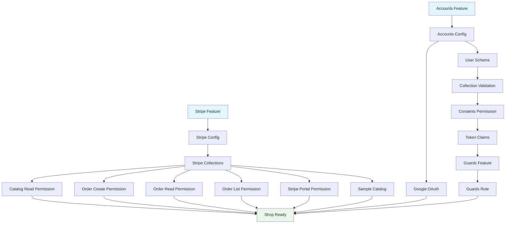

# Ulabase Service Configuration

The Ulabase service requires specific configuration to support the shop application's authentication, authorization, legal compliance, and payment processing. This configuration is defined declaratively in `ulabase.setup.ts` and consists of ACL permissions, Guards rules, collection schemas, token claims, and feature configurations.

## Overview

The service configuration ensures:
- **Public catalog browsing** for both guests and signed-in users
- **Order placement and retrieval** with proper access controls
- **Legal compliance** through consents gating
- **Payment processing** via Stripe integration
- **User management** with accounts feature

## ACL Permissions

ACL permissions control access to collections and endpoints. The application defines five permissions that map to specific access patterns.

### Permission to Predicate and Role Mapping

```mermaid
flowchart TD
    subgraph "Catalog Access"
        A["catalog-read-anon"] --> B["path(/catalog) or path-template('/catalog/{docid}')"]
        B --> C["method(GET)"]
        C --> D["Roles: $unauthenticated, user"]
    end
    
    subgraph "Order Operations"
        E["orders-create-anon"] --> F["path(/orders)"]
        F --> G["method(POST)"]
        G --> H["Roles: $unauthenticated, user"]
        
        I["orders-read-anon"] --> J["path-template('/orders/{id}')"]
        J --> K["method(GET)"]
        K --> L["Roles: $unauthenticated, user"]
        
        M["orders-list-own"] --> N["path(/orders)"]
        N --> O["method(GET)"]
        O --> P["Roles: user"]
    end
    
    subgraph "Stripe Portal"
        Q["stripe-portal"] --> R["path('/stripe/portal')"]
        R --> S["method(POST)"]
        S --> T["Roles: user"]
    end
    
    subgraph "Consents"
        U["userCanPatchOwnConsents"] --> V["path-template('/users/{userId}')"]
        V --> W["method(PATCH)"]
        W --> X["Roles: user"]
    end
    
    style A fill:#e1f5fe
    style E fill:#e1f5fe
    style I fill:#e1f5fe
    style M fill:#e8f5e8
    style Q fill:#e8f5e8
    style U fill:#fff3e0
```



*The five ACL permissions and their corresponding predicates and roles.*

### 1. Catalog Read Permission (`catalog-read-anon`)

**Purpose**: Allows anyone to browse the product catalog.

**What breaks when missing**: The shop appears empty with no error message.

**Configuration**:
```typescript
{
  predicate: `(path(/catalog) or path-template('/catalog/{docid}')) and method(GET)`,
  roles: ['$unauthenticated', 'user'],
  priority: 100,
  mongo: {
    readFilter: {
      $or: [
        { purchasable: true },
        { variants: { $elemMatch: { purchasable: { $ne: false } } } }
      ]
    }
  }
}
```

**Catalog ReadFilter Logic**: The filter handles two product shapes:
- **Flat products**: Have a top-level `purchasable: true` field
- **Variant products**: Have variants where `purchasable` is not false (omitted defaults to true)

This ensures both product types appear in the catalog while hiding draft/unavailable items.

### 2. Order Creation Permission (`orders-create-anon`)

**Purpose**: Allows anyone to place orders via POST.

**What breaks when missing**: Guest checkout returns 401.

**Configuration**:
```typescript
{
  predicate: `path(/orders) and method(POST)`,
  roles: ['$unauthenticated', 'user'],
  priority: 100
}
```

**Note**: Only POST is allowed—PATCH would let buyers set their own order status to "paid".

### 3. Order Read Permission (`orders-read-anon`)

**Purpose**: Allows reading individual orders with secret verification.

**What breaks when missing**: After payment, the order return page shows 401.

**Configuration**:
```typescript
{
  predicate: `path-template('/orders/{id}') and method(GET)`,
  roles: ['$unauthenticated', 'user'],
  priority: 100,
  mongo: { readFilter: { secret: "@qparams['secret']" } }
}
```

**Secret Verification**: The order secret (returned during creation) proves ownership for guests without sessions.

### 4. Order List Permission (`orders-list-own`)

**Purpose**: Allows signed-in users to list orders from their billing account.

**What breaks when missing**: Signed-in users see empty order history.

**Configuration**:
```typescript
{
  predicate: `path(/orders) and method(GET)`,
  roles: ['user'],
  priority: 90,
  mongo: { readFilter: { 'payer.id': '@user.team._id' } }
}
```

**Team-Based Filtering**: Users see orders charged to their billing account (their own and those of anyone they share it with).

### 5. Stripe Portal Permission (`stripe-portal`)

**Purpose**: Allows signed-in users to access Stripe billing portal.

**What breaks when missing**: Signed-in users get 403 when trying to access billing portal.

**Configuration**:
```typescript
{
  predicate: "path('/stripe/portal') and method(POST)",
  roles: ['user'],
  priority: 100
}
```

## SHOPPERS Permission Pattern

The application uses a single permission with both `$unauthenticated` and `user` roles rather than two separate permissions.

**Why one permission with two roles, not two permissions**:
- **ACL Authorizer Behavior**: Matches only the first permission it finds for a request
- **Signed-in User Breakage**: With `$unauthenticated` alone, signed-in users would get 403 (they carry `user` role, not `$unauthenticated`)
- **Role Order Dependency**: Two rules for the same path would make which one applies depend on role order

**Result**: Consistent access regardless of authentication state.

```typescript
const SHOPPERS = ['$unauthenticated', 'user'];
```

## Consents Guards Rule

The Guards feature blocks users who haven't accepted current legal documents (Terms of Service and Privacy Policy).

### Rule Condition

The rule blocks when **either** acceptance is missing (not both):

```typescript
const CONDITION = [
  "equals(@authenticated, 'true')",           // Only authenticated users
  "not path-prefix('/auth')",                 // Allow auth endpoints
  "not path-prefix('/token')",                // Allow token endpoints
  "not (method(PATCH) and path-template('/users/{userId}') and bson-request-whitelist(consents))", // Allow consents acceptance
  `not (equals(@user.latestConsents.tos, '${TOS_VERSION}') and equals(@user.latestConsents.pp, '${PP_VERSION}'))` // Block if missing
].join(' and ');
```

**Key Exclusions**:
- **Anonymous callers**: Excluded via `@authenticated` (true when request carries account)
- **Auth endpoints**: `/auth` and `/token` paths are excluded (needed for login/registration)
- **Consents acceptance**: The PATCH endpoint for accepting consents is excluded
- **Legal document paths**: `/terms` and `/privacy` are readable while blocked

**Status Code**: 451 (Unavailable For Legal Reasons) - exactly matches the situation.

### Client-Side Implementation

The `ConsentsGate` component:
- Sits at root, above router (blocked users have no session)
- Shows acceptance form when API returns 451
- Allows reading legal documents while blocked
- Calls `auth.acceptConsents()` (server stamps versions, client sends nothing)
- Reloads session after acceptance

The `consents-signal.ts` module:
- Raises flag on any 451 from service
- Passed to `RhAuthProvider` as `config.onError`
- Distinguishes "blocked" from "signed out"

## Consents Acceptance Permission (`userCanPatchOwnConsents`)

**Purpose**: Allows users to update their own consents via PATCH.

**What breaks when missing**: Acceptance returns 403, user locked out permanently.

**Configuration**:
```typescript
{
  predicate: "path-template('/users/{userId}') and method(PATCH) and (equals(@user._id, ${userId}) or equals(@user.sub, ${userId})) and bson-request-whitelist(consents)",
  roles: ['user'],
  priority: 1,
  mongo: {
    mergeRequest: {
      latestConsents: { tos: TOS_VERSION, pp: PP_VERSION, acceptedAt: '@now' },
      _$push: { consents: { tos: TOS_VERSION, pp: PP_VERSION, acceptedAt: '@now' } }
    }
  }
}
```

**Key Features**:
- **Server-stamped versions**: Client sends `{"consents": []}` and states nothing
- **Version comparison**: Check compares stamped versions against current versions
- **History growth**: `$push` grows consents array instead of overwriting
- **Ownership verification**: Only user can update their own consents

**Critical Check**: The step verifies both presence and version match—bumping versions shows work outstanding, not satisfied.

## Token Claims

Token claims ensure the Guards rule can evaluate consents status.

**Required Claims**:
- `latestConsents/tos` - Current Terms of Service version
- `latestConsents/pp` - Current Privacy Policy version  
- `team` - User's team (for orders list filtering)

**Configuration**:
```typescript
const CLAIMS = ['latestConsents/tos', 'latestConsents/pp', 'team'];
```

**Why Required**:
- Guards rule reads token, not database
- Missing claim compares false for every token-authenticated user
- Blocks users permanently while condition looks reasonable
- JWT payload is base64, not encrypted (readable by anyone holding token)

## User Schema (USER_SCHEMA)

The JSON schema validates user documents and defines required fields.

**Required Fields**:
- `_id` - User identifier
- `password` - Hashed password
- `roles` - Array of role strings
- `profile` - Object with required `name` and `surname`

**Consents Fields**:
- `latestConsents` - Object with `tos`, `pp`, and `acceptedAt` (BSON date)
- `consents` - Array of acceptance history

**Important Notes**:
- `acceptedAt` uses `_$date` (escaped BSON type key in schema)
- `latestConsents` and `consents` are NOT required (validated before initial team attachment)
- `_id` IS required (direct PUT needs id in body)

**Schema Validation**:
1. Schema stored with ID `userConsentsSchema`
2. Applied to `users` collection via PATCH to `/users/_meta`
3. Registration through `/auth/register` passes validation

## Token Claims Configuration

Token claims are configured in the service's `account-properties-claims` array.

**Configuration Step**:
```typescript
step('the two claims travel in the token', {
  async check({ admin, srvId }) {
    const res = await admin.fetch(`/auth-config/${encodeURIComponent(srvId)}`);
    const config = (await res.json()) as { 'account-properties-claims'?: string[] };
    const current = config['account-properties-claims'] ?? [];
    return CLAIMS.every(c => current.includes(c));
  },
  async apply({ admin, srvId }) {
    const res = await admin.fetch(`/auth-config/${encodeURIComponent(srvId)}`);
    const config = (await res.json()) as { 'account-properties-claims'?: string[] };
    const current = config['account-properties-claims'] ?? [];
    await admin.fetch(`/auth-config/${encodeURIComponent(srvId)}`, {
      method: 'PATCH',
      body: JSON.stringify({
        'account-properties-claims': [...new Set([...current, ...CLAIMS])],
      }),
    });
  },
})
```

**Key Points**:
- Added, not replaced (service may carry claims of its own)
- Only these three claims in token (consents history grows, not in token)
- Missing claims block users permanently

## Consents Version Management

Legal document versions are managed centrally:

**Version Files**:
- `src/legal-versions.ts` exports `TOS_VERSION` and `PP_VERSION`
- Current values: `'2026-07-01'` for both

**Version Flow**:
1. **Setup stamps versions**: Permission's `mergeRequest` stamps current versions
2. **Guards rule compares**: Token claims compared against current versions
3. **Updating versions**: Bump versions in `legal-versions.ts`, re-run setup
4. **Re-acceptance**: Every user meets acceptance form on next request
5. **History preserved**: Previous acceptances stay in `consents` array

**Critical Invariant**: Check compares versions, not just presence—bumping versions shows work outstanding.

## Setup Execution

### Running the Setup

```bash
# Configure service
npx @ulabase/cli setup --srv <srvId>

# Check what's missing without changes
npx @ulabase/cli setup --srv <srvId> --dry-run
```

### Step Dependencies



*Step dependencies: Stripe and accounts configurations are independent, but consents require accounts to be configured first.*

### Check/Apply Pattern

Each step follows:
1. **Check**: Examines whether desired state is satisfied
2. **Apply**: Configures service if check fails
3. **Re-check**: Verifies success

**Benefits**:
- Idempotent (re-running writes nothing if configured)
- Safe (checks verify actual state)
- Transparent (`--dry-run` shows what needs fixing)
- Reliable (failed applies can be retried)

## Failure Modes

### Missing Permissions

| Permission | Symptom | User Experience |
|------------|---------|-----------------|
| `catalog-read-anon` | Empty shop | No products shown, no error |
| `orders-create-anon` | 401 on checkout | Cannot place order |
| `orders-read-anon` | 401 on order return | Cannot see order confirmation |
| `orders-list-own` | Empty order history | Signed-in users see no orders |
| `stripe-portal` | 403 on portal | Cannot access billing |
| `userCanPatchOwnConsents` | 403 on acceptance | Locked out permanently |

### Missing Token Claims

- Guards rule compares false for every user
- Blocks users permanently
- Condition looks reasonable but fails silently

### Version Mismatch

- User accepts, stamped with old version
- Guards rule compares against new version
- User blocked forever by form that said it worked

## Extension Points

### Adding New Permissions

1. Define permission with predicate and roles
2. Add to setup file with check/apply
3. Test with `--dry-run`
4. Consider SHOPPERS pattern for public access

### Updating Legal Documents

1. Edit `TOS_VERSION` and `PP_VERSION` in `src/legal-versions.ts`
2. Re-run setup to update Guards rule and permission
3. Users meet acceptance form on next request
4. Previous acceptances preserved in history

### Customizing Consents Logic

- Modify `CONDITION` in Guards rule for different exclusions
- Update `mergeRequest` for different stamping behavior
- Adjust `readFilter` for different access patterns

## Best Practices

1. **Use `--dry-run` first**: See what's missing before applying
2. **Test permission changes**: Verify access patterns after changes
3. **Monitor consents acceptance**: Track 451 responses
4. **Backup before major changes**: Especially version updates
5. **Document custom predicates**: Explain non-obvious access patterns

## Related Pages

- [Service Setup](../concepts/service-setup.md) - Declarative setup file overview
- [Stripe Integration](stripe.md) - Payment processing configuration
- [Consents Gate Workflow](../workflows/consents-gate.md) - Client-side consents flow
