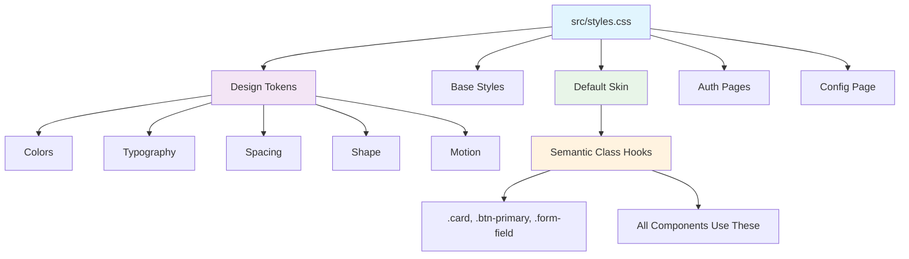
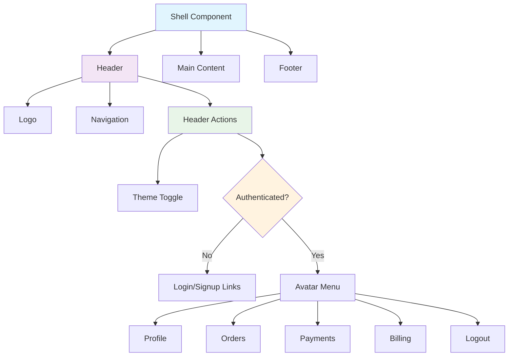

# Customization and Theming

The Ulabase Starter Ecommerce app is designed with a disposable default skin. All visual styling lives in `src/styles.css` and component CSS files, making it straightforward to reskin the entire shop through two distinct paths.

## Design System Architecture

The stylesheet (`src/styles.css`) is organized into five clear sections:

1. **Design tokens** (Section 1) — CSS custom properties that define the entire visual language
2. **Base styles** (Section 2) — Element-level defaults that apply the tokens globally
3. **Default skin** (Section 3) — Semantic class hooks that implement the mockup look
4. **Auth pages** (Section 4) — Specific styling for authentication flows
5. **Config page** (Section 5) — Styling for the configuration screen



*The stylesheet architecture: tokens flow through semantic hooks to all components.*

## Two Customization Paths

### Path A: Tweak the Existing Skin

Fastest approach — roughly an hour to something that looks like your brand:

1. **Change design tokens** in `src/styles.css` Section 1 — colors, type scale, spacing, radii. Every component reads them, so this re-themes the whole app including dark mode.
2. **Adjust skin classes** in Section 3 if you want different shapes.
3. **Replace shell layout** in `src/pages/shell/Shell.tsx` and `Shell.css`.
4. **Replace home page** in `src/pages/home/` with your own landing content.

### Path B: Adopt a UI Framework

For Material, shadcn/ui, Tailwind, or your own framework:

1. **Delete skin sections** 3–5 of `src/styles.css` (they are clearly marked). Keep Section 1 if you want the tokens; drop it too if your framework brings its own.
2. **Reskin components** using the swap map below.

## Design Tokens

Design tokens are CSS custom properties defined in `:root` and overridden for dark mode in `:root.dark`. They form the single source of truth for the entire visual system.

### Color Tokens

```css
:root {
  --color-bg: #f4f6f8;
  --color-surface: #ffffff;
  --color-surface-sunken: #eef1f4;
  --color-border: #d8dde4;
  --color-border-strong: #b6bfcb;
  --color-text: #14171c;
  --color-text-muted: #656d7a;
  
  /* Ulabase amber — the one accent. Paired with dark text. */
  --color-primary: #f8a839;
  --color-primary-hover: #e0942b;
  --color-on-primary: #14171c;
  
  /* Ulabase's teal-green, darkened for readable text-link contrast */
  --color-link: #1f6f54;
  --color-success: #1f6f54;
  
  --color-error: #b91c1c;
  --color-error-bg: #fef2f2;
  --color-on-error: #ffffff;
  
  /* Faint drafting-paper grid */
  --color-grid: rgba(20, 23, 28, 0.045);
}
```

### Typography Tokens

```css
:root {
  --font-family: system-ui, -apple-system, "Segoe UI", Roboto, sans-serif;
  --font-mono: ui-monospace, SFMono-Regular, "SF Mono", Menlo, Consolas, "Liberation Mono", monospace;
  
  --text-xs: 0.6875rem;
  --text-sm: 0.8125rem;
  --text-base: 0.875rem;
  --text-md: 0.9375rem;
  --text-lg: 1.125rem;
  --text-xl: 1.5rem;
  --text-2xl: 2rem;
  
  --leading-tight: 1.25;
  --leading-normal: 1.55;
  --tracking-label: 0.09em;
}
```

### Spacing and Shape Tokens

```css
:root {
  /* Spacing scale */
  --space-1: 0.25rem;
  --space-2: 0.5rem;
  --space-3: 0.75rem;
  --space-4: 1rem;
  --space-5: 1.5rem;
  --space-6: 2rem;
  --space-7: 3rem;
  --space-8: 4rem;
  
  /* Shape */
  --radius-sm: 3px;
  --radius: 5px;
  --radius-lg: 8px;
  --radius-pill: 999px;
  --border-width: 1px;
  
  /* Motion & elevation */
  --transition: 0.15s ease;
  --shadow-popup: 0 8px 24px rgba(20, 23, 28, 0.12);
}
```

## Dark Mode Implementation

Dark mode is implemented through a class-based override system in `Shell.tsx`:

```typescript
// src/pages/shell/Shell.tsx
const STORAGE_KEY = 'rh-theme';

function useTheme() {
  const [dark, setDark] = useState(() => {
    if (typeof window === 'undefined') return false;
    return localStorage.getItem(STORAGE_KEY) === 'dark';
  });

  useEffect(() => {
    document.documentElement.classList.toggle('dark', dark);
  }, [dark]);

  const toggle = useCallback(() => {
    setDark(prev => {
      const next = !prev;
      document.documentElement.classList.toggle('dark', next);
      localStorage.setItem(STORAGE_KEY, next ? 'dark' : 'light');
      return next;
    });
  }, []);

  return { dark, toggle };
}
```

**Key behaviors:**
- Preference persisted in `localStorage` under key `rh-theme`
- Toggles `.dark` class on `document.documentElement`
- Default is light mode
- Since every color flows through a token, no per-component changes are needed

## Swap Map: Semantic Class Hooks

Components reference a small, stable vocabulary of semantic class hooks. Restyle them, or replace each element with your framework's component:

| Class hook | Used for | Tailwind (example) | Material (example) |
|---|---|---|---|
| `.card` / `.card-header` | Section container + its title row | `rounded border p-6 mb-6` | `<Card>` |
| `.btn-primary` | The one accented action per form | `px-6 py-2 rounded bg-amber-400 font-semibold` | `<Button variant="contained">` |
| `.btn-secondary` | Quiet bordered action | `px-3 py-2 rounded border text-xs uppercase` | `<Button variant="outlined">` |
| `.btn-danger` / `.btn-danger-text` | Destructive action / inline variant | `… text-red-700 border-red-700` | `<Button variant="outlined" color="error">` |
| `.form-field` / `.form-field-sm` / `.form-row` | Label+control stack; `-sm` is narrow; `-row` lays fields side by side | `flex flex-col gap-1` / `flex gap-3` | `<TextField>` |
| `.password-field` / `.btn-toggle-password` | Password input with a Show/Hide toggle | `relative` / `absolute right-2` | `<TextField>` + end adornment |
| `.form-error` / `.field-error` | Form-level / per-field error | `rounded border border-red-300 bg-red-50 p-3` | `<FormHelperText error>` |
| `.success-msg` | Success feedback | `rounded border border-emerald-300 bg-emerald-50 p-3` | — (usually a snackbar) |
| `.muted` | Secondary/caption text | `text-sm text-gray-500` | `className="body2"` |
| `.badge` | Small status pill | `rounded-full px-2 text-xs uppercase` | `<Chip size="small">` |
| `.back-link` / `.eyebrow` | Back navigation / label above a title | `text-xs uppercase tracking-wide` | — |
| `.placeholder` / `.skeleton` | Empty-slot outline / loading block | `border border-dashed p-6` / `animate-pulse bg-gray-200` | `<LinearProgress>` |
| `.auth-page` / `.auth-card` / `.auth-links` / `.divider` | Centred auth layout | `min-h-screen grid place-items-center` / `w-90 rounded border p-8` | `<Card>` |
| `.config-page` / `.config-card` / `.config-status` / `.config-steps` | "Connect your service" screen | — | — |

**Important**: Page-specific layout (`.team-row`, `.member-row`, `.feature-grid`, …) stays in the component's own `.css` file and is not part of this contract.

## Alert Component

The Alert component (`src/ui/alert/Alert.tsx`) is the single shared feedback component that carries all success and error messages throughout the app.

```typescript
// src/ui/alert/Alert.tsx
export function Alert({ type, dismissible = true, autoDismiss = 4000, onClose, children }: AlertProps) {
  useEffect(() => {
    if (autoDismiss > 0) {
      const id = setTimeout(onClose, autoDismiss);
      return () => clearTimeout(id);
    }
  }, [autoDismiss, onClose]);

  return (
    <div className={type === 'success' ? 'success-msg' : 'form-error'} 
         role={type === 'success' ? 'status' : 'alert'}>
      <span style={{ flex: 1 }}>{children}</span>
      {dismissible && (
        <button type="button" onClick={onClose} aria-label="Dismiss">
          &times;
        </button>
      )}
    </div>
  );
}
```

**Key responsibilities:**
- Carries `.success-msg` and `.form-error` hooks (from the swap map)
- Provides correct ARIA roles (`status` for success, `alert` for errors)
- Supports auto-dismiss with configurable timeout (default 4 seconds)
- Supports manual dismissal with accessible close button
- **Swap this one component and every success/error message in the app follows**

## Vite Configuration for Local Kit Development

When developing against a local `@ulabase/kit` or `@ulabase/kit-react` checkout, `vite.config.ts` needs three additional settings:

```typescript
// vite.config.ts additions for local kit development
export default defineConfig({
  plugins: [react()],
  resolve: { dedupe: ['react', 'react-dom', 'react-router-dom'] },
  optimizeDeps: { exclude: ['@ulabase/kit', '@ulabase/kit-react'] },
  server: { fs: { allow: ['..'] } },
});
```

**Why these are needed:**
- `resolve.dedupe`: Forces a single copy of React to prevent "Invalid hook call" errors when symlinked packages resolve their own imports from their real path
- `optimizeDeps.exclude`: Prevents Vite from snapshotting symlinked dependencies
- `server.fs.allow`: Lets Vite serve sources from outside the project root

**Important**: After changing linking (npm link/unlink), stop the dev server and delete `node_modules/.vite` first. Vite resolves modules once and caches them.

## Shell Layout Customization

The shell (`src/pages/shell/Shell.tsx`) is the app's frame for all users, intentionally outside `AuthGuard`:



*Shell structure: header with navigation and user menu, main content area, and footer.*

**Key customization points:**
- Replace logo and branding in `Shell.tsx`
- Modify navigation links and structure
- Customize user menu items and actions
- Adjust header layout in `Shell.css`

## Extending the System

### Adding New Tokens

1. Add new CSS custom properties in `:root` and `:root.dark` sections
2. Use consistent naming: `--color-*`, `--text-*`, `--space-*`, `--radius-*`
3. Document any new semantic meaning

### Creating New Semantic Classes

1. Define new classes in Section 3 of `styles.css`
2. Follow existing patterns (e.g., `.new-component` with token usage)
3. Update this swap map if the class should be reskinnable

### Dark Mode Considerations

When adding new components:
1. Always use design tokens for colors
2. Test both light and dark modes
3. Ensure sufficient contrast ratios
4. Use `color-mix()` for transparent variations

## Migration Checklist

When adopting a UI framework:

1. **Backup current styles** — copy `src/styles.css` for reference
2. **Delete skin sections** 3–5 (clearly marked in comments)
3. **Install framework** — e.g., `npm install @mui/material` or `npm install -D tailwindcss`
4. **Replace semantic classes** using the swap map above
5. **Update Alert component** to use framework's feedback components
6. **Test dark mode** — ensure your framework respects the token overrides
7. **Verify accessibility** — maintain ARIA roles and keyboard navigation

## Related Pages

- [Architecture Overview](../architecture/overview.md) — Overall application structure
- [Configuration and Deployment](configuration-and-deployment.md) — Build and hosting setup
