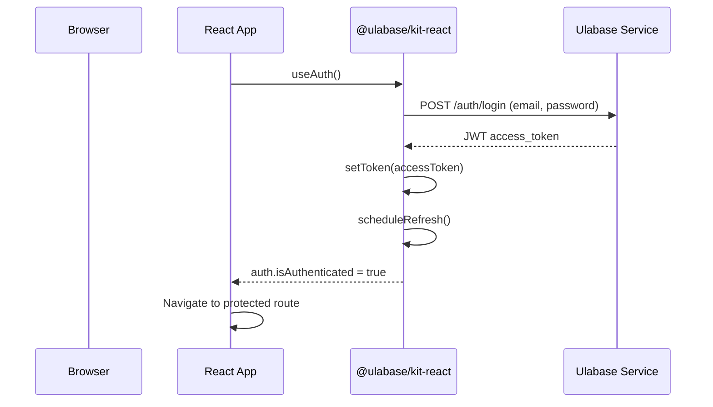
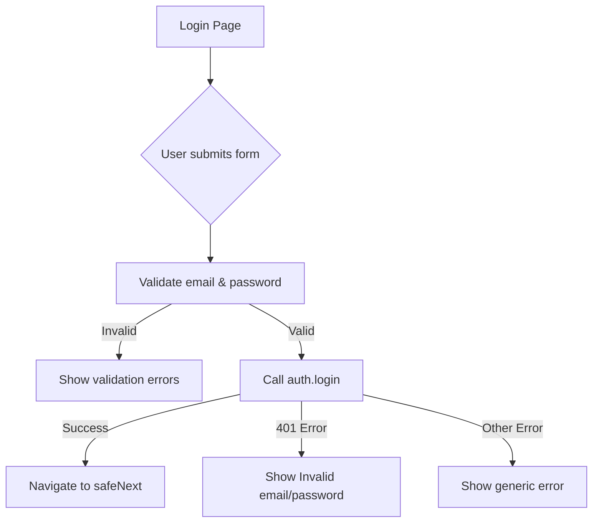
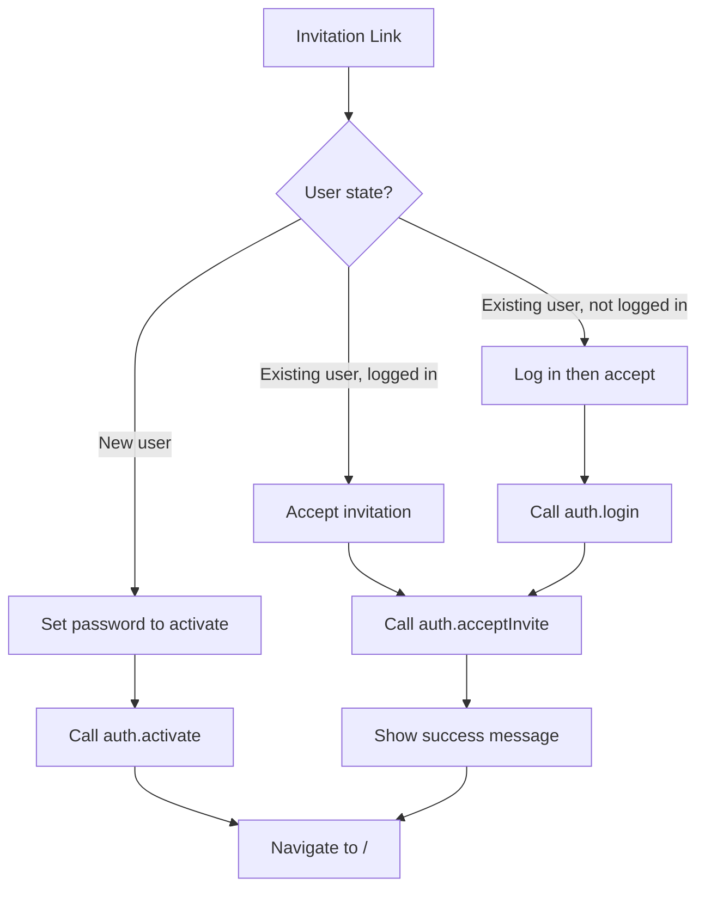

# Authentication and Invitation Flows

This page documents the authentication system of the Ulabase Ecommerce Starter, including user login, signup, email verification, password reset, Google OAuth, and the three-path invitation acceptance flow. All authentication operations go through the `useAuth` hook from `@ulabase/kit-react`, which communicates with the Ulabase service's `/auth/*` endpoints.

## Auth Architecture Overview

The authentication system is built on `@ulabase/kit-react`, which provides:

- **`useAuth()` hook**: Central authentication interface exposing methods like `login()`, `register()`, `verify()`, `forgotPassword()`, `resetPassword()`, `acceptInvite()`, `getInvitation()`, `activate()`, and `logout()`.
- **`RhAuthProvider`**: Context provider that manages authentication state, session restoration, and token refresh.
- **`AuthGuard`** and **`PublicGuard`**: Route guards that protect authenticated routes and redirect authenticated users away from auth pages.
- **Token management**: Automatic token refresh via `scheduleRefresh()` and fragment token capture for OAuth/email verification redirects.



## Feature Flag Gating

Authentication routes are conditionally included based on feature flags in `src/environments/environment.ts`. These flags must match the service's "Sign-up Mgmt → Features" toggles; mismatches cause silent failures.

| Route | Feature Flag Required | Purpose |
|-------|----------------------|---------|
| `/auth/signup` | `emailRegistration` OR `oauthLogin` | User registration |
| `/auth/verify` | `emailRegistration` | Email verification |
| `/auth/forgot-password` | `passwordReset` | Password reset initiation |
| `/auth/reset-password` | `passwordReset` | Password reset completion |
| `/invitations/accept` | `teamInvitations` | Invitation acceptance |

Routes that don't match their feature flags are excluded from the router entirely. This means:
- The signup route won't exist if both `emailRegistration` and `oauthLogin` are false
- The verify route won't exist if `emailRegistration` is false
- Password reset routes won't exist if `passwordReset` is false
- The invitation acceptance route won't exist if `teamInvitations` is false

## Authentication Flows

### Login Flow

The login page (`/auth/login`) handles email/password authentication and optionally displays OAuth buttons.

**Key behaviors:**
- Protected by `PublicGuard` - redirects authenticated users away
- Validates email format and password presence before submission
- Displays `invalid_token` error from URL search params (for expired/invalid links)
- Calls `auth.login(email, password)` on successful validation
- Navigates to `safeNext(params)` after login (prevents open redirect vulnerabilities)
- Shows "Forgot password?" link only when `passwordReset` feature is enabled
- Shows "Create an account" link only when `emailRegistration` or `oauthLogin` is enabled



### Signup Flow

The signup page (`/auth/signup`) handles user registration with email/password or OAuth.

**Key behaviors:**
- Protected by `PublicGuard`
- Creates a team with name "{firstName}'s account" (not "team" - better UX for shop context)
- Validates: firstName, lastName, email format, password ≥ 8 characters
- Calls `auth.register({ teamName, firstName, lastName, email, password })`
- On success, shows "Check your email" message (email verification required)
- Handles 409 error for duplicate email addresses
- OAuth buttons shown when `oauthLogin` is true
- Email form shown only when `emailRegistration` is true

**Just-signed-up signal:**
After successful registration, the URL will contain `?flow=signup`. The `consumeFragmentToken()` function in `App.tsx` detects this and sets `setJustSignedUp(true)`. The `Shell` component reads this flag and shows a welcome banner: "Welcome aboard — your account is ready." The flag is automatically cleared after the component mounts.

### Email Verification Flow

The verify page (`/auth/verify`) handles email verification links.

**Key behaviors:**
- Protected by `PublicGuard`
- Requires `email` and `token` query parameters
- Calls `auth.verify(email, token)` which returns a URL
- Redirects to the returned URL (typically the app with an access token in the hash)
- Shows error states for missing parameters or failed verification
- Only available when `emailRegistration` feature is enabled

**Fragment token flow:**
After email verification or OAuth redirect, the token arrives in the URL hash (e.g., `#access_token=xxx`). The `consumeFragmentToken()` function in `App.tsx`:
1. Extracts `access_token` from the hash
2. Calls `setToken(accessToken)` to store it
3. Calls `scheduleRefresh()` to set up automatic token refresh
4. Removes the hash from the URL for clean history

### Password Reset Flow

Two pages handle password reset:

**Forgot Password (`/auth/forgot-password`):**
- Protected by `PublicGuard`
- Calls `auth.forgotPassword(email)`
- API always returns 202 regardless of email existence (prevents email enumeration)
- Shows "Check your email" message regardless of success/failure
- Only available when `passwordReset` feature is enabled

**Reset Password (`/auth/reset-password`):**
- Protected by `PublicGuard`
- Requires `email` and `token` query parameters (from reset link)
- Validates password ≥ 8 characters
- Calls `auth.resetPassword({ email, token, password })`
- On success, navigates to `/` (user is now logged in)
- Handles 401 error for invalid/expired reset links

## Google OAuth Setup

Google OAuth requires configuration on both the Google Cloud Console and the Ulabase service.

**Setup steps:**

1. **Google Cloud Console:**
   - Create an OAuth client of type "Web application"
   - Set redirect URI: `https://<srvId>.ulabase.app/auth/oauth/callback/google`

2. **Ulabase service configuration:**
   - Set environment variables: `GOOGLE_CLIENT_ID` and `GOOGLE_CLIENT_SECRET`
   - Run `ulabase setup --srv <srvId>` to configure the service

3. **Frontend configuration:**
   - Set `oauthLogin: true` in `src/environments/environment.ts`
   - `oauthProviders` already defaults to `['google']`

**OAuth button implementation:**
The `OAuthButtons` component renders OAuth provider buttons. It generates URLs using `oauthUrl(provider)` which constructs: `${environment.apiUrl}/auth/oauth/authorize/${provider}?noauthchallenge`

The `noauthchallenge` parameter prevents the service from returning a 401 challenge for unauthenticated requests to the OAuth endpoint.

## Invitation Acceptance Flow

The invitation acceptance page (`/invitations/accept`) handles team invitations through three distinct paths based on user state.

**Route characteristics:**
- **No guard** - works for both signed-in and signed-out users
- Requires `email` and `token` query parameters
- Only available when `teamInvitations` feature is enabled
- Not wrapped in `Shell` - renders as a centered auth card

**Flow overview:**



### Path 1: New User Activation

When `invitation.isNewUser` is true:

1. Show "Join {teamName}" form with password field
2. User sets password (minimum 8 characters)
3. Call `auth.activate({ email, token, password })`
4. On success, navigate to `/` (user is now logged in and joined team)

### Path 2: Already Logged In User

When `auth.isAuthenticated` is true and user is not new:

1. Show "Join {teamName}" with current email
2. User clicks "Join team" button
3. Call `auth.acceptInvite(token)`
4. On success, show "You're in" message
5. Redirect to `/` after 1.2 seconds

### Path 3: Existing User Not Logged In

When user is not authenticated and not new:

1. Show "Log in to join {teamName}" with email pre-filled
2. User enters password
3. Call `auth.login(email, password)`
4. On successful login, automatically call `acceptForLoggedInUser()`
5. Same as Path 2 after login

**Error handling:**
- 404: "This invitation is invalid or has expired."
- 401: "Invalid password." (for login step)
- Other: Show error message from API

## Safe Navigation After Auth

The `safeNext()` function prevents open redirect vulnerabilities when redirecting users after authentication.

**Security measures:**
- Only accepts paths starting with `/` (relative paths)
- Rejects protocol-relative URLs (`//host`)
- Rejects absolute URLs (`https://elsewhere.example`)
- Falls back to `/` if validation fails

**Usage:**
- Login page: `navigate(safeNext(searchParams))` after successful login
- `next` parameter in URL specifies where to redirect (e.g., `/auth/login?next=/cart`)

## Session Management

**Token refresh:**
- `scheduleRefresh()` sets up automatic token refresh before expiration
- Uses the service's `/token` endpoint
- Refresh happens silently in the background

**Session restoration:**
- `RhAuthProvider` automatically restores session on app load
- Calls `/users/me` to get current user data
- Failure triggers consents gate if 451 status (user hasn't accepted current terms)

**Logout:**
- `auth.logout()` clears tokens and session
- Redirects to `/` (shop) not login page
- Reason: signing out of a shop is not "leaving" it

## Integration with Consents Gate

The consents gate interacts with authentication:

1. **On app load:** `RhAuthProvider` tries to restore session by calling `/users/me`
2. **If user hasn't accepted current terms:** Service returns 451 status
3. **`consentsOnError` callback:** Sets blocked flag in `consents-signal.ts`
4. **`ConsentsGate` component:** Renders overlay instead of app
5. **User accepts terms:** Calls `auth.acceptConsents()` then `auth.checkSession()`
6. **Gate dismissed:** App proceeds normally

**Important:** Guests (unauthenticated users) are never blocked by the consents gate because they have no user document to stamp. Their consent is handled by a checkout checkbox.

## Configuration and Environment

**Environment variables (for service, not frontend):**
- `GOOGLE_CLIENT_ID`: Google OAuth client ID
- `GOOGLE_CLIENT_SECRET`: Google OAuth client secret

**Feature flags in `environment.ts`:**
```typescript
features: {
  emailRegistration: true,    // Email/password signup
  passwordReset: true,        // Forgot/reset password flows
  oauthLogin: false,          // Google OAuth (enable after setup)
  oauthProviders: ['google'], // Supported OAuth providers
  teamInvitations: true,      // Team invitation system
}
```

**API base URL:**
- Must point to tenant service: `https://<srvId>.ulabase.app`
- NOT `https://api.ulabase.com` (admin node)
- Empty URL shows configuration screen instead of app

## Error Handling Patterns

**Authentication errors:**
- 401: Invalid credentials, expired tokens, or invalid reset/verification links
- 409: Duplicate email during registration
- 451: User hasn't accepted current terms (triggers consents gate)

**UI patterns:**
- Field-level validation on blur
- Form-level validation on submit
- Loading states during async operations
- Error messages with dismissal option
- Success messages with auto-redirect

## Testing Considerations

**Manual testing flows:**
1. **Email registration:** Sign up → verify email → login
2. **Password reset:** Forgot password → check email → reset password
3. **OAuth:** Sign up/login with Google
4. **Invitations:** Send invitation → accept as new user
5. **Invitations:** Send invitation → accept as existing user (logged in)
6. **Invitations:** Send invitation → accept as existing user (not logged in)

**Edge cases to test:**
- Expired verification/reset links
- Invalid invitation tokens
- Duplicate email registration
- OAuth cancellation
- Network errors during auth operations
- Feature flags disabled scenarios
