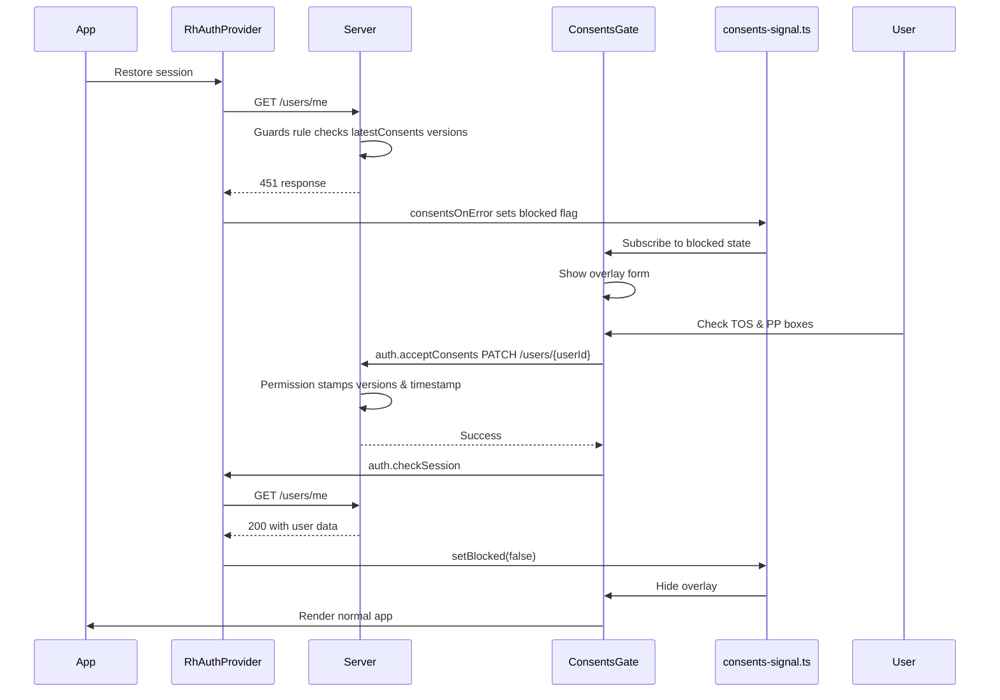

# Consents Gate Flow

The consents gate ensures that registered users cannot use the application until they have accepted the current versions of the Terms of Service (TOS) and Privacy Policy (PP). The flow involves client-side UI and server-side enforcement working together.

## Why the Gate is Above the Router

The `ConsentsGate` component sits **above the router** in the component hierarchy because:

- A blocked user has **no valid session** — the server refuses `/users/me` with a 451 status.
- If the gate were inside the router, `AuthGuard` would see the missing session and bounce the user to the login page.
- The login page itself would also be blocked because authentication endpoints are exempt, but the subsequent session check would fail again.
- Placing the gate above the router ensures the user sees the acceptance form rather than being stuck in a redirect loop.

## Guests Are Never Blocked

Guest users (anonymous visitors) are **never blocked** by the consents gate because:

- Guests have no user document in the database to stamp with consent versions.
- The guard rule uses `@authenticated` to skip anonymous requests entirely.
- Guest consent is handled only at checkout via a checkbox — they don't need to accept the full terms to browse the shop.

## Three-Part Architecture

The consents gate consists of three interconnected components:

1. **`consents-signal.ts`** — A pub/sub flag that tracks whether the user is blocked.
2. **`ConsentsGate.tsx`** — The UI overlay that replaces the app when blocked.
3. **Guards rule** — Server-side enforcement that returns 451 for unauthenticated users.

## Sequence Diagram



## Legal Paths Exemption

The paths `/terms` and `/privacy` are **exempt** from the consents gate overlay:

- A user must be able to read the legal documents before agreeing to them.
- These routes are defined in the router and render normally even when the gate is active.
- The server still answers 451 to other requests, but these specific paths are allowed through.

## Single Source of Truth: `legal-versions.ts`

The file `src/legal-versions.ts` contains the canonical versions of both documents:

```typescript
export const TOS_VERSION = '2026-07-01';
export const PP_VERSION = '2026-07-01';
```

This file is imported by:
- **`ulabase.setup.ts`** — to stamp versions in the permission and configure the guard rule.
- **Legal pages** — to display the current versions to users.
- **Other components** — to reference the versions when needed.

**Why this matters:** Having versions in one place prevents mismatches between what the server expects and what the client shows. When you publish new documents, edit these strings and re-run the setup — every user will meet the acceptance form again on their next request.

## Client-Side Components

### `consents-signal.ts`

This module implements a simple pub/sub pattern to track the blocked state:

- **`isBlocked()`** — Returns the current blocked state.
- **`setBlocked(next)`** — Updates the state and notifies listeners.
- **`subscribe(listener)`** — Registers a listener for state changes; returns an unsubscribe function.
- **`consentsOnError`** — Error handler passed to `RhAuthProvider`; sets blocked=true when a 451 status is received.

### `ConsentsGate.tsx`

The main component that:
- Sits above the router in `App.tsx`.
- Renders a modal overlay with two checkboxes (TOS and PP).
- Shows links to `/terms` and `/privacy` (readable while blocked).
- Calls `auth.acceptConsents()` when both boxes are checked.
- Reloads the session via `auth.checkSession()` after successful acceptance.
- Provides a "Sign out" option to clear the blocked state and logout.

**Key design decisions:**
- The overlay has no close button or backdrop click — only accepting or signing out can dismiss it.
- The overlay is not `aria-modal` because it replaces the app rather than floating over it.
- The footer remains visible outside the gate.

## Server-Side Enforcement

### Guards Rule

The guard rule is configured in `ulabase.setup.ts` with:
- **Condition:** Checks if the user is authenticated, excludes auth/token endpoints and the acceptance endpoint, then checks if `latestConsents` versions match the current versions.
- **Action:** Block with status 451 (Unavailable For Legal Reasons).
- **Error handling:** `on_error: allow` — if the rule cannot be evaluated, it doesn't lock everyone out.

### Permission for Acceptance

A specific permission (`userCanPatchOwnConsents`) allows users to update their own consents:
- Only allows PATCH on `/users/{userId}` for the authenticated user.
- Only allows updates to the `consents` field (via `bson-request-whitelist`).
- Stamps the current versions and timestamp via `mergeRequest`.
- Maintains a history of all acceptances in the `consents` array.

### Token Claims

Two claims are added to the JWT token:
- `latestConsents/tos`
- `latestConsents/pp`
- `team`

This allows the guard rule to check versions without hitting the database on every request.

## Flow Summary

1. **App loads** → `RhAuthProvider` restores session by calling `/users/me`.
2. **Server checks** → Guards rule verifies if user has accepted current versions.
3. **451 response** → If not accepted, server returns 451.
4. **`consentsOnError`** → Sets blocked flag in `consents-signal.ts`.
5. **`ConsentsGate`** → Subscribes to blocked state, shows overlay form.
6. **User accepts** → Checks both boxes, clicks "I accept".
7. **`auth.acceptConsents()`** → PATCHes user document with consent data.
8. **Permission stamps** → Server updates `latestConsents` with current versions and timestamp.
9. **Session restored** → `auth.checkSession()` reloads user data.
10. **Gate dismissed** → `setBlocked(false)` hides overlay, normal app renders.

## Configuration

To update legal documents:
1. Edit `src/legal-versions.ts` with new version strings.
2. Re-run the setup: `npx @ulabase/cli setup --srv <srvId>`.
3. All users will see the acceptance form again on their next request.

## Error Handling

- **Network failures:** The acceptance form shows a generic error message.
- **Server errors:** The permission's `mergeRequest` handles validation; the client sends minimal data.
- **Token issues:** The guard rule uses token claims; if claims are missing, it blocks by default (failsafe).

## Security Considerations

- **Versions are server-side:** The client never sends version numbers — the server stamps them.
- **Acceptance history:** All acceptances are recorded with timestamps.
- **Legal paths:** Terms and privacy pages remain accessible while blocked.
- **Guest isolation:** Guests are never blocked; they have separate consent at checkout.
