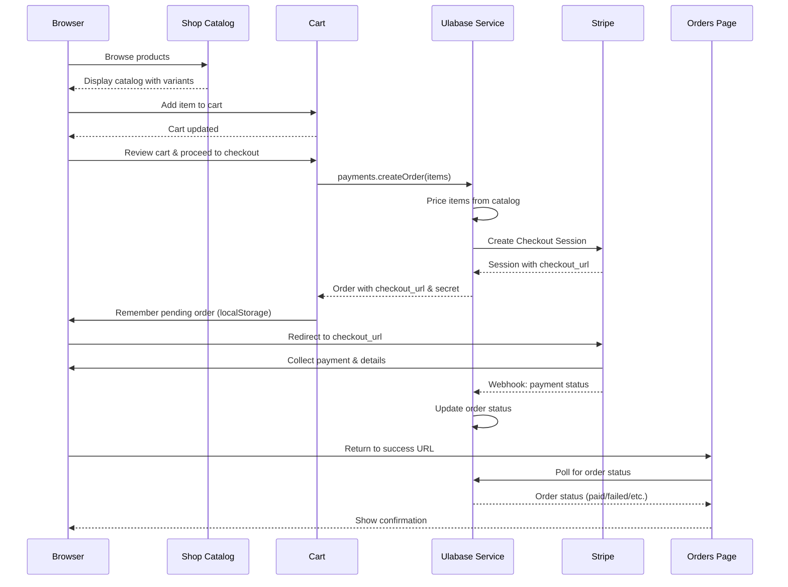
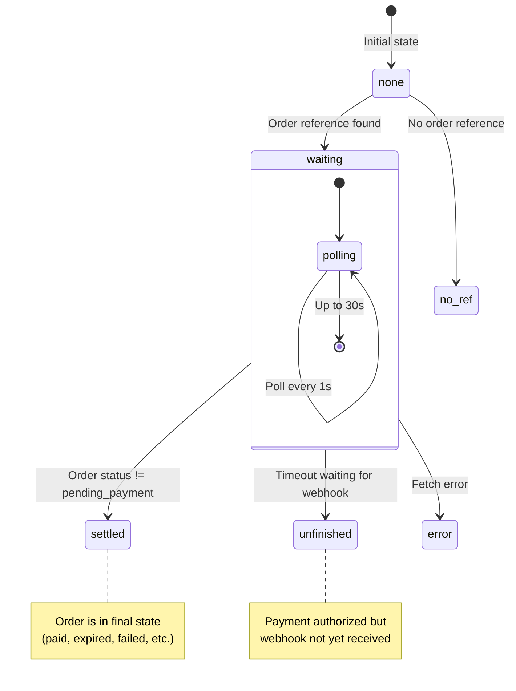
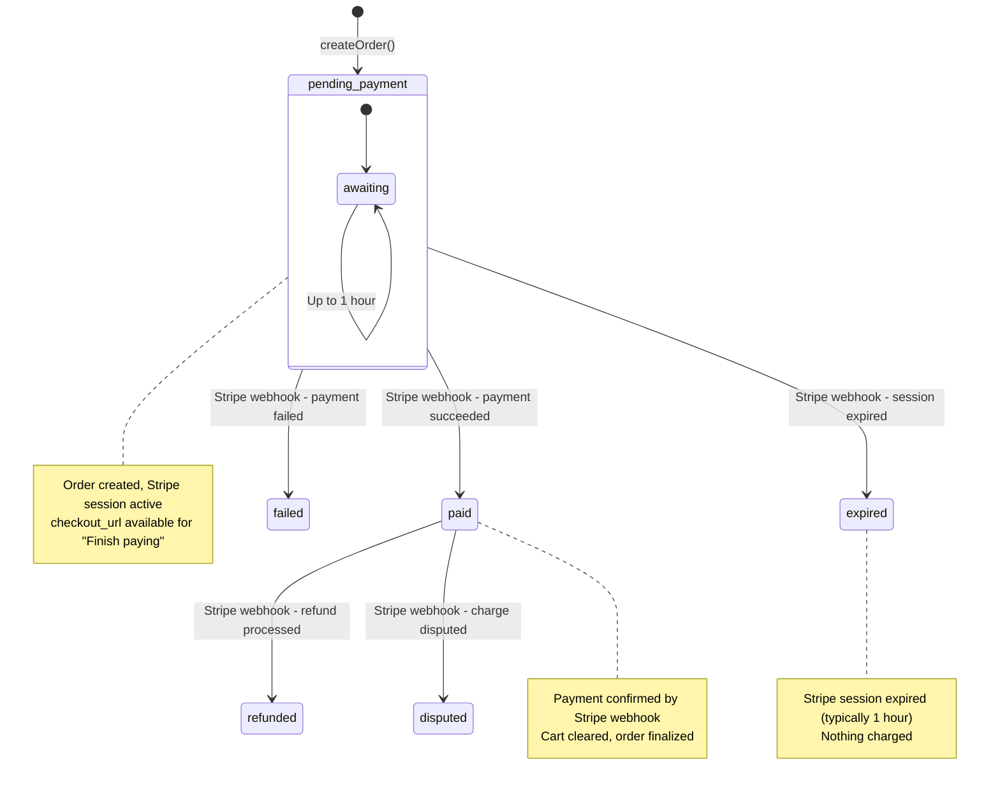
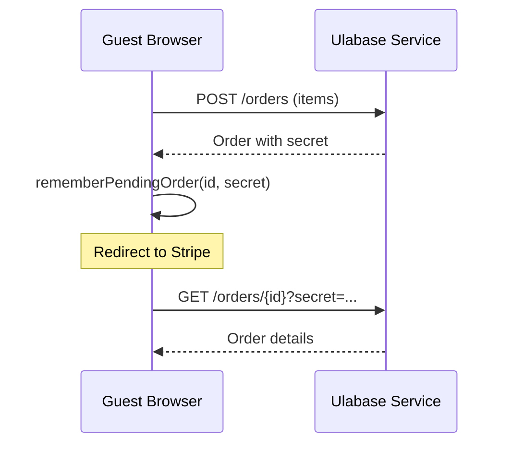
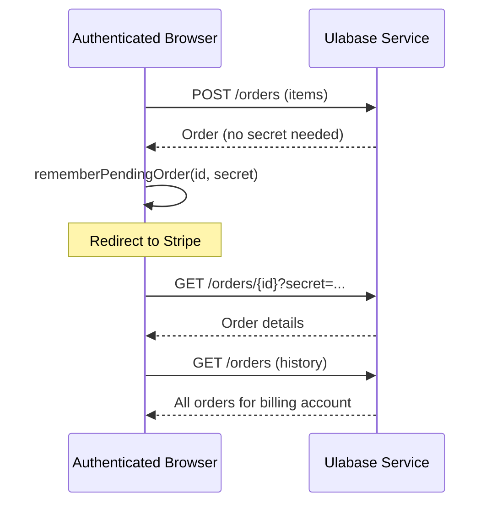

# End-to-End Purchase Flow

This page documents the complete buyer journey from browsing the catalog through adding items to cart, initiating Stripe checkout, handling payment confirmation via webhooks, and viewing order results. The flow supports both guest and authenticated purchases with different identity mechanisms.

## Flow Overview



*Complete purchase flow showing the interaction between browser, shop, cart, Ulabase service, Stripe, and orders page.*

## Catalog Browsing

The shop catalog is fetched using `payments.getCatalog()` with filtering and pagination:

```typescript
payments.getCatalog({
  collection: environment.catalogCollection,  // 'catalog' by default
  filter: { category: 'apparel', name: { $regex: 'mug', $options: 'i' } },
  page: 1,
  pagesize: 24,
  sort: 'name',
})
```

**Key behaviors:**
- Products are filtered by the ACL's `readFilter` - unsellable items never reach the client
- Infinite scroll pagination with intersection observer
- Category and search filters stored in URL parameters
- Product URLs work standalone (bookmarked, shared)

## Cart Operations

The cart is entirely client-side until checkout, managed by `RhCartProvider`:

```typescript
interface CartLine {
  productId: string;          // "product-id/variant-id" or just "product-id"
  name: string;
  image?: string;
  unitAmount: number;
  currency: string;
  quantity: number;
  options?: Record<string, string>;  // { color: "yellow", size: "L" }
}
```

**Cart state management:**
- `cart.lines` - Array of cart items
- `cart.add(item, quantity)` - Add item with variant options
- `cart.setQuantity(productId, quantity)` - Update quantity
- `cart.remove(productId)` - Remove item
- `cart.clear()` - Empty entire cart
- `cart.subtotal` - Display-only sum
- `cart.orderItems` - Items formatted for order creation (preserves variant options)

**Important invariant:** Cart is NOT cleared at checkout start. It remains intact until payment is confirmed on the Orders page. This preserves the cart for:
- Users who reach Stripe and change their mind
- Users who use Stripe's cancel link to return to cart
- Abandoned payments

## Checkout Process

### Step 1: Build Order Items

Use `cart.orderItems` directly, not hand-rolled objects:

```typescript
const items = cart.orderItems;  // Preserves variant options
```

### Step 2: Create Order

```typescript
const order = await payments.createOrder(
  items,
  undefined,  // No email - Stripe collects this
  environment.catalogOrdersCollection  // 'orders' by default
);
```

**Key points:**
- Server prices items from its own catalog - cart amounts are display-only
- No email collection needed - Stripe collects and webhook writes back
- No shipping address collection - Stripe collects and webhook writes back
- Response includes: `order._id.$oid`, `order.secret`, `order.checkout_url`

### Step 3: Stash Pending Order

Before redirecting to Stripe, save order reference locally:

```typescript
rememberPendingOrder(order._id.$oid, order.secret);
```

This solves the problem of identifying orders when buyers return from Stripe, especially for guests with no session. The stash uses `localStorage` (not `sessionStorage`) to persist across tabs.

### Step 4: Redirect to Stripe

```typescript
window.location.href = order.checkout_url;
```

The success URL is configured server-side and cannot carry the order ID or secret. The service URL template is:

```
/orders#order={ORDER_ID}&secret={ORDER_SECRET}
```

The secret is placed in the URL fragment (after `#`) so it never reaches server logs or Referer headers.

## Pending-Order Stash

The pending-order system (`src/shop/pending-order.ts`) manages order references across the Stripe redirect:

### Why localStorage (Not sessionStorage)

- Buyers may complete payment in a different tab
- sessionStorage doesn't follow across tabs
- localStorage persists across tabs and sessions

### Data Structure

```typescript
interface PendingOrder {
  id: string;           // Order ID
  secret: string;       // Order secret (treat as password)
  createdAt: number;    // Epoch ms - used for expiry
}
```

### Constraints

- **Maximum entries:** 10 (oldest removed when exceeded)
- **Maximum age:** 24 hours (entries older than this are automatically dropped)
- **List, not single entry:** Supports multiple concurrent checkouts (e.g., two tabs open on the same shop)

### Operations

- **`rememberPendingOrder(id, secret)`** - Add/update entry (newest first)
- **`readPendingOrder()`** - Get most recent pending order
- **`readPendingOrders()`** - Get all pending orders
- **`clearPendingOrder(id?)`** - Clear one order (by ID) or all orders

## Orders Page Flow

The Orders page (`src/pages/shop/Orders.tsx`) serves dual roles:

1. **Stripe return page** - Polls for payment confirmation
2. **Order history** - Lists orders for signed-in users

### Stripe Return Flow

When a user returns from Stripe, the page reads the order reference from two sources (in priority order):

1. **URL fragment** - Interpolated by the service into the success URL
2. **localStorage stash** - Fallback from `readPendingOrder()`

The URL fragment is read once and immediately stripped from the address bar to prevent the secret from being screenshotted, shared, or bookmarked.

### Confirming State Machine

The page tracks payment confirmation through a state machine:



**States:**
- **`none`** - No order reference found (page opened normally, not returned from Stripe)
- **`waiting`** - Polling for order status (waiting for webhook)
- **`settled`** - Order reached final state (paid, expired, failed, etc.)
- **`unfinished`** - Payment authorized but webhook not received within timeout
- **`error`** - Error reading order

### Polling Mechanism

For users just returning from Stripe:

```typescript
payments.waitForOrder(ref.id, ref.secret, {
  collection: environment.catalogOrdersCollection,
  timeoutMs: 30_000,    // 30 second timeout
  intervalMs: 1_000,    // Poll every second
  signal: controller.signal,
});
```

**Why poll?** Stripe redirects as soon as payment is authorized, but the order only moves off `pending_payment` when Stripe's webhook arrives - a separate connection, usually seconds later, with no ordering guarantee against the redirect.

For users just viewing history (not returning from payment):
- Single read via `payments.getOrder()`
- No polling needed

### Cart Clearing Logic

The cart is cleared **only on confirmed payment**:

```typescript
if (result.status === 'paid') cart.clear();
```

This ensures:
- Abandoned checkouts preserve the cart
- Failed payments preserve the cart
- Expired orders preserve the cart
- Only successful purchases clear the cart

### Pending Order Cleanup

When an order reaches a final state, it's removed from the pending orders list:

```typescript
if (result.status !== 'pending_payment') clearPendingOrder(ref.id);
```

This prevents stale entries from accumulating and avoids confusing "unfinished" states for orders that are actually completed.

## Order Lifecycle

Orders move through the following states:



### State Descriptions

**`pending_payment`**
- Initial state after order creation
- Stripe checkout session is active
- User can complete payment via `checkout_url`
- Stripe expires session automatically (typically 1 hour)
- "Awaiting payment" in the UI

**`paid`**
- Payment confirmed by Stripe webhook
- Order finalized, cart cleared
- Receipt email sent (if configured)
- Shipping address recorded from Stripe

**`expired`**
- Stripe session expired before payment
- Nothing charged
- "Not paid in time" in the UI

**`failed`**
- Payment attempt failed
- Nothing charged
- "Payment failed" in the UI

**`refunded`**
- Payment was refunded (partial or full)
- Refund email sent (if configured)

**`disputed`**
- Charge was disputed (chargeback)
- Requires resolution

## Guest vs. Authenticated Paths

### Guest Checkout

**Identity mechanism:** No session, proves ownership via order secret



**Key characteristics:**
- No user account required
- Order identified by secret (prove ownership)
- No order history (orders tied to billing account)
- Secret must be preserved across Stripe redirect
- Success URL fragment contains both ID and secret

### Authenticated Checkout

**Identity mechanism:** User session, orders filtered by payer.id



**Key characteristics:**
- User account required
- Orders filtered by `payer.id` (billing account)
- Can view order history
- Secret still used for cross-redirect identification
- ACL: `readFilter: { 'payer.id': '@user.team._id' }`

## Error Handling

### Checkout Errors

- **401:** Service requires account to order (ACL decision)
- **Other:** Generic checkout failure message

### Order Reading Errors

- **404 on URL return:** Order not found (contact support)
- **404 on stash fallback:** Stale entry, silently cleared
- **Timeout:** Payment authorized but webhook late, shows "unfinished" state

### Pending Order Errors

- **localStorage full:** Silent failure, falls back to asking for order ID
- **Parse errors:** Returns empty list, treated as no pending orders

## Security Considerations

1. **Order secret treated as password** - Never exposed in URLs, logs, or error messages
2. **URL fragment for secret** - Doesn't reach server logs or Referer headers
3. **Immediate URL cleanup** - Secret stripped from address bar on page load
4. **Pending order expiry** - 24-hour automatic cleanup
5. **Final state cleanup** - Orders removed from stash when completed

## Integration Points

### Stripe

- Creates checkout sessions via `payments.createOrder()`
- Receives payment confirmation via webhooks
- Handles refunds and disputes
- Collects shipping address and email

### Ulabase Service

- Stores orders in configured collection (default: `orders`)
- Applies pricing from catalog
- Manages ACL and read filters
- Interpolates order ID/secret into success URL

### Cart Provider

- Client-side state management
- Persists across page navigation
- Clears on confirmed payment
- Provides `orderItems` with variant options

## Testing Scenarios

Key scenarios to test:

1. **Normal flow:** Add to cart → checkout → pay → return → cart cleared
2. **Abandoned checkout:** Add to cart → checkout → abandon → return → cart preserved
3. **Multiple tabs:** Two tabs checking out simultaneously
4. **Guest checkout:** No account, order identified by secret
5. **Webhook delay:** Payment authorized but webhook arrives late
6. **Expired session:** Leave Stripe open >1 hour
7. **Failed payment:** Card declined
8. **Return without payment:** Use Stripe's cancel link
9. **StrictMode double-run:** Ensure order reference is read once, not lost on second effect run

## Configuration

### Success URL Template

Configured in `ulabase.setup.ts`:

```typescript
const SUCCESS_URL = `${origin}/orders#order={ORDER_ID}&secret={ORDER_SECRET}`;
```

Variables:
- `{ORDER_ID}` - Order ID (interpolated by service)
- `{ORDER_SECRET}` - Order secret (interpolated by service)
- `{CHECKOUT_SESSION_ID}` - Stripe session ID (available but not used)

### Cancel URL

```typescript
const CANCEL_URL = `${origin}/cart`;
```

Returns users to cart with items preserved.

### Collection Names

```typescript
catalogCollection: 'catalog',
catalogOrdersCollection: 'orders',
```

Configured in `src/environments/environment.ts` and must match service configuration.

## Troubleshooting

### Payment goes through but order stays "pending"

The webhook is not arriving. In Stripe, open your event destination and look at recent deliveries:
- **401 or 404** — URL is wrong (must end in `/stripe/webhook`)
- **400** — Signing secret doesn't match
- No `checkout.session.completed` in selected events — nothing sent at all

### Orders page shows "unfinished" after payment

Webhook delay. The payment is authorized (Stripe has the money), but the webhook hasn't arrived. Wait a minute and reload. The order will update when the webhook arrives.

### Guest can't see order after payment

The order secret is missing. Ensure:
1. Success URL includes `{ORDER_ID}` and `{ORDER_SECRET}` in fragment
2. `readPendingOrder()` returns the stashed reference
3. The fragment wasn't stripped before reading (StrictMode runs effects twice)

### Cart cleared but order shows "pending"

Race condition: cart cleared on first read, webhook arrived later. The cart should only clear on confirmed `paid` status, not on first read.

## Related Pages

- [Cart and Order Lifecycle](../domains/cart-and-orders.md) - Cart state management and order lifecycle
- [Shop Catalog](../domains/shop-catalog.md) - Product browsing and variant selection
- [Stripe Integration](../integrations/stripe.md) - Stripe configuration and webhook handling
